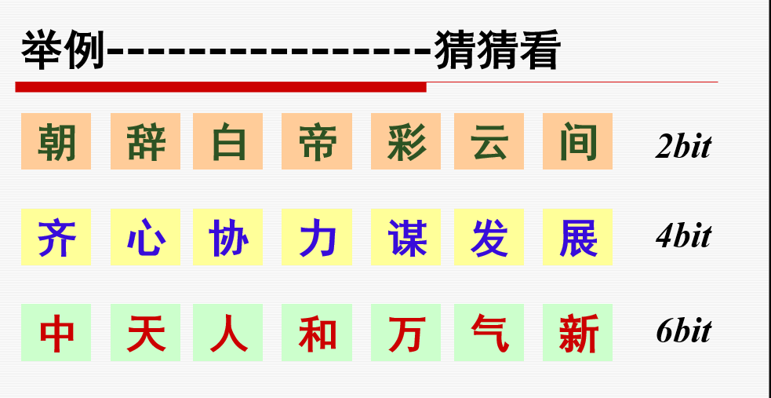
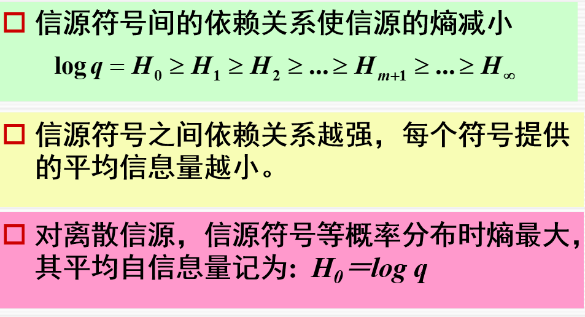
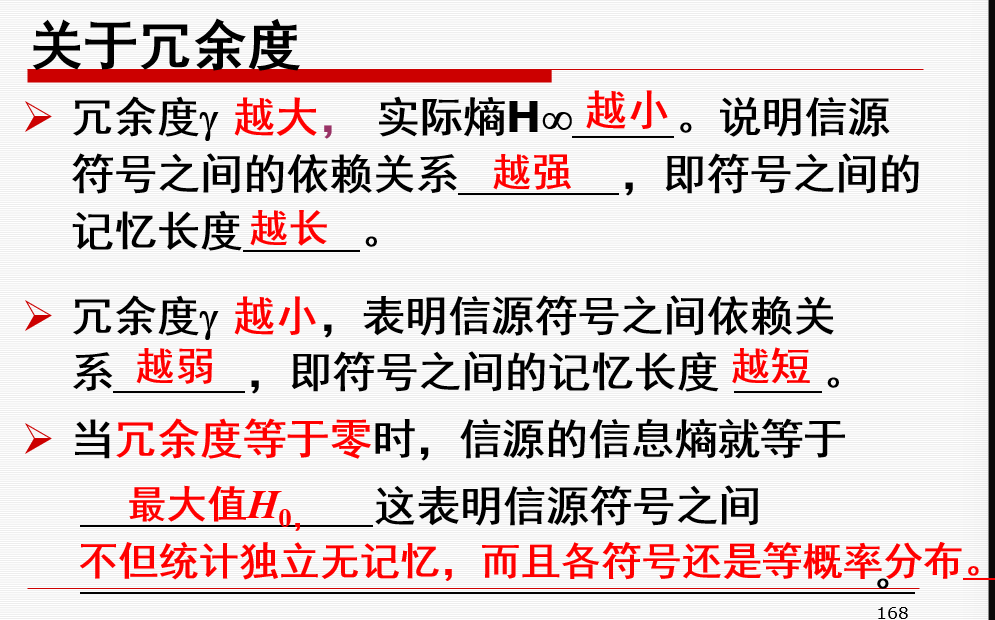
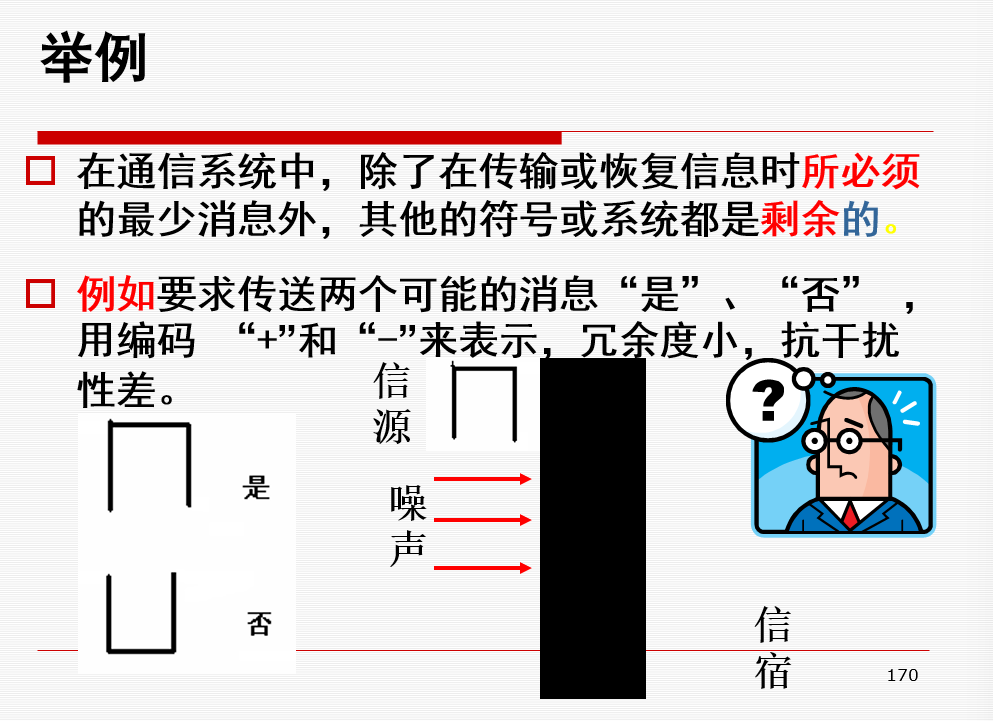
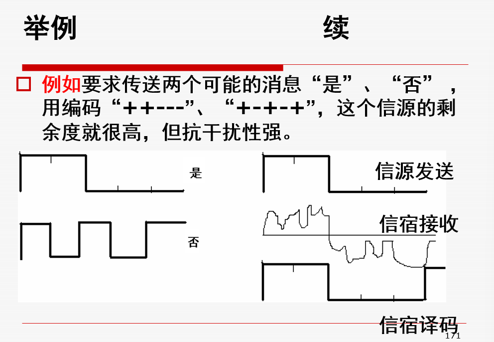
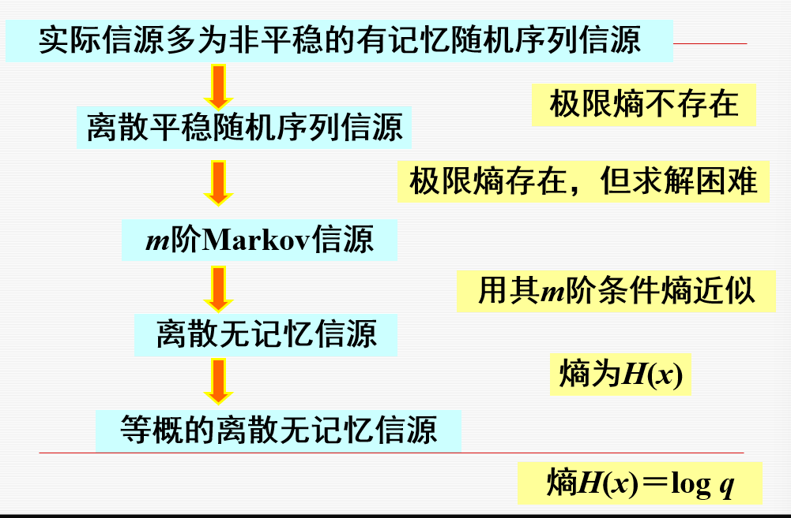

（注 这里的值是估算值，只是引出后面定义）
对于第一句诗句，我们看到前两个字大概就知道后面是什么了，而对于后面两个诗句，我们就比较陌生，则每个字提供的信息量多一些
那么就出现了下面的分析：

# 冗余度的定义
熵的相对率————一个信源的实际的信息熵和具有同样符号集的最大熵的比值称为相对率
这里最大熵的计算方式是$\log_2{q}$,其中q是信源的符号数
$$\eta = \frac{H_\infty}{H_0}$$
信源冗余度就是1减去信源的相对率$$\gamma = 1 - \eta = 1 - \frac{H_\infty}{H_0}$$

## 冗余度的好和坏
信源冗余度是进行无失真信源压缩编码的理论依据，表示信源可以无失真压缩的程度
减少或消除信源剩余都可以提高信息传输的效率（每个字传输的信息量增多）
增加剩余度可以提高信息传输抗干扰能力

# 自然语言的熵
