# 信源编码
信息通过信道传输到信宿的过程即为通信。要做到既不失真又快速地通信，需要解决两个问题：
- 在不失真或允许一定失真条件下，如何提高信息传输速度----这是本章要讨论的信源编码问题.
- 在信道受到干扰的情况下，如何增加信号的抗干扰能力，同时又使得信息传输率最大----这是以后要讨论的信道编码问题.
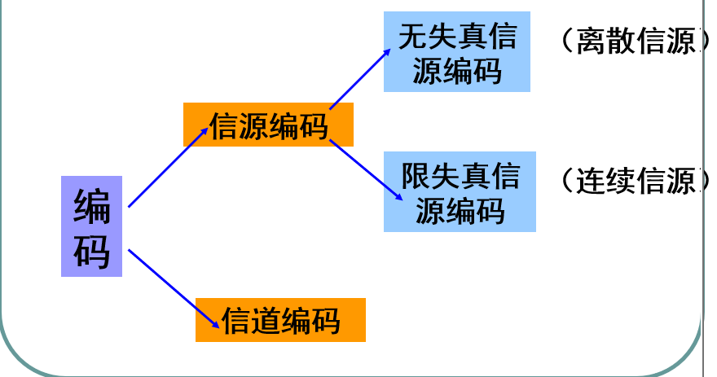
# 信源编码的主要任务
减少冗余，提高编码效率
也就是一个寻找信源发出的信号的统计序列，将其转换成更高效的编码的方式
（比如，19G242，19C……班的信息被转换成计科x班，将复杂的信号在保留特征的基础上简单化，同时我们都明白转化后的结果对应转化之前的什么意思）
# 基本概念
## 无失真信源编码
无失真信源编码要求精确地复现信源的输出，要保证信源的全部信息无损的传给信宿
我们在研究过程中只考虑编码的有效性，不考虑可靠性，同时将信道编码默认成一个无噪无损信道
## 编码器
这里的编码器不是硬件，而是一种将信源按照一定规则转换成符号序列的规则或算法
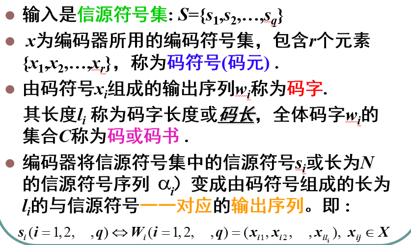
## 码的分类
码有多种分类方式
### 按照码元个数分
我们通常根据码集合中元素的个数来给各种码分类，比如二元码和r元码，即集合中元素的个数分别是2和r

### 分组码
若每个信源符号按照固定的码表映射成一个码字，则称为分组码。否则就是非分组码
比如下面的例子
设有二元信道的信源编码器,其信源概率空间为
$ \begin{bmatrix} S \\ P \end{bmatrix} = \begin{bmatrix} s_1 & s_2 & s_3 & s_4 \\ p(s_1) & p(s_2) & p(s_3) & p(s_4) \end{bmatrix} $
二元信道它的信道基本符号集为{0,1}.若将信源S通过一个二元信道传输,就必须把信源符号si变化成由0,1组成的码元序列.
### 定长码和变长码
这是一种根据码长分类的方法
- 定长码：码中所有码字长度都相同
- 变长码：码字长短不一

### 奇异码和非奇异码
这是一种分组码根据信源符号和码字是否一一对应来分的分类方式
- 奇异码：存在不同信源符号被编码成相同的码字的情况
    所以一般情况下奇异码在译码时会产生歧义，无法还原成原始信息
- 非奇异码：不同的信源符号一定和不同的码字一一对应

### 非唯一可译码和唯一可译码
非奇异码对码字序列能否还原成符号序列的分类
- 唯一可译码：任意有限长的码元序列，只能被分割成一种码字序列
  例：{0,10,11}是唯一可译码。
        100111000，只能被分割成10，0，11，10，0
- 非唯一可译码：能被分成多种码元序列的

### 即时码和非即时码
  我们可以将唯一可译码再分类成即时码和非即时码
- 即时码：又称为非延长码，任意一个码字都不能是其它码字的前缀部分，有时又叫异前缀码
- 非即时码：如果接收端收到一个完整的码字后，不能立即译码，还需要等到，下一个码字开始接收后才能判断时候可以开始译码，这样的码叫非即时码
00，10，011，010 是即时码，当收到00 10时立刻就能判断其码字
00，01，011，111 是非即时码，当收到01后无法判断是不是信号01 因为也可能是信号011还没发完

### 总结
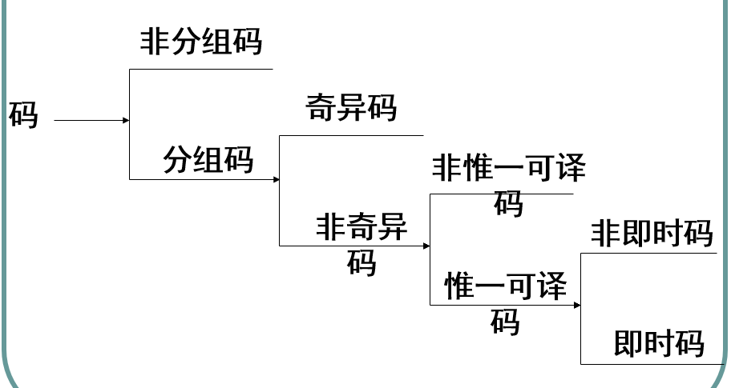

# 码的N次扩展码
对编码方式的一种推广
将码的N次扩展编码，就是将信源符号的N元组作为一个整体，映射成N个码字的连续序列，也就是一次性输出多个码字，将输出结果视为一个新的整体码字
信源$S$的$N$次扩展信源为 $\boldsymbol{S}^N=(a_j, j=1,2,\dots,q^N)$.  

其中，$N$次扩展信源符号为 $a_j, j=1,2,\dots,q^N$，  
且 $a_j = s_{j1}s_{j2}\dots s_{jN}$  

经信源编码后，相应有 $\boldsymbol{C}^N=(W_j, j=1,2,\dots,q^N)$  

其中,码字 $W_j, j=1,2,\dots,q^N$ 是和$N$次扩展信源$\boldsymbol{C}^N$中  
信源符号 $a_j, j=1,2,\dots,q^N$ 一一对应。
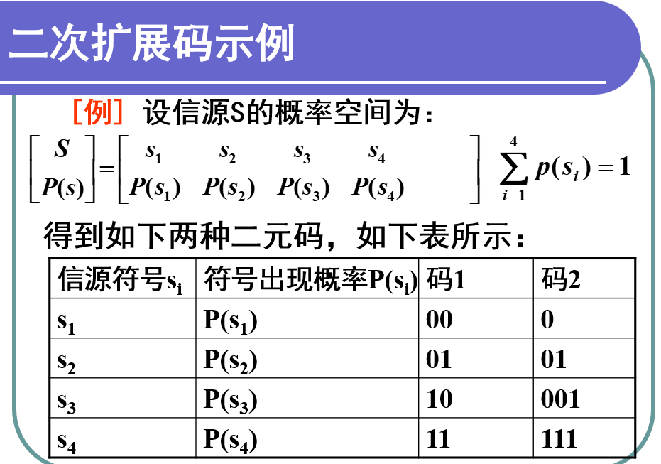
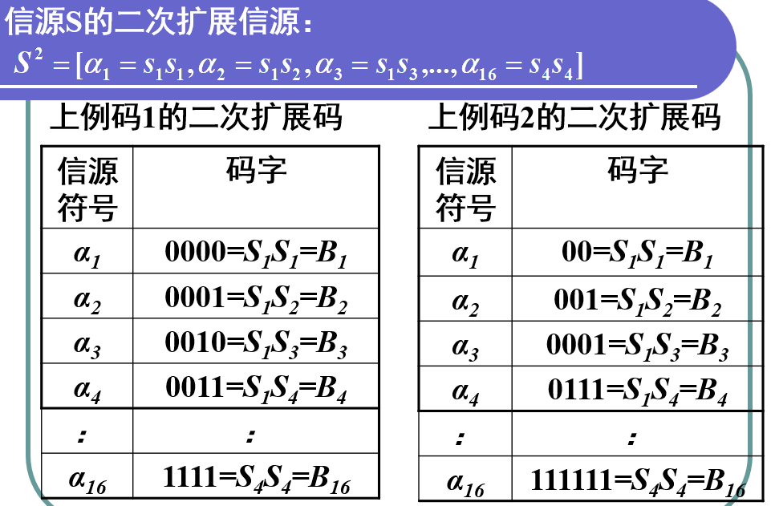

# 码树
对于给定码字的全体集合，我们可以用码树来表示
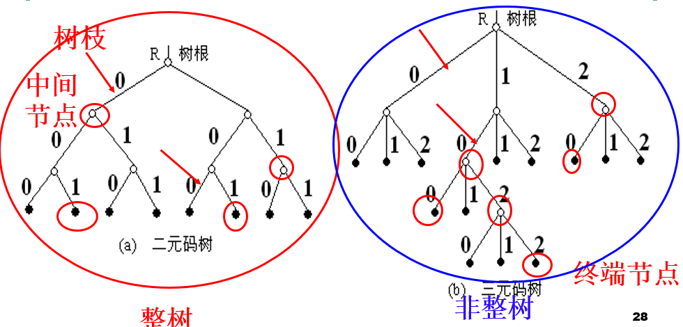
其中，码数和码的对应关系如下：
树根 ←→ 码字起点；
树枝数 ←→ 码的进制数；
节点 ←→ 码字或码字的一部分；
终端节点 ←→ 码字；
阶数 ←→ 码长；
非整树 ←→ 变长码；
整树 ←→ 等长码。

# 无失真编码要求
- 变长码要满足唯一可译码的条件，它必须是非奇异码
- 为了能够即时译码，变长码必须是即时码

>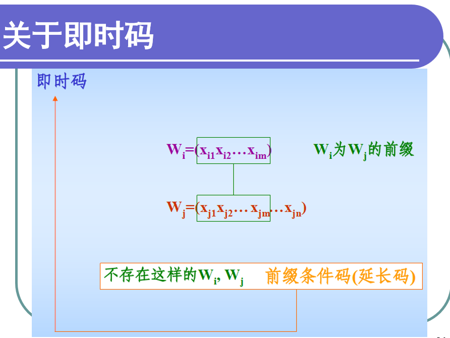
即时码的树图构造如下
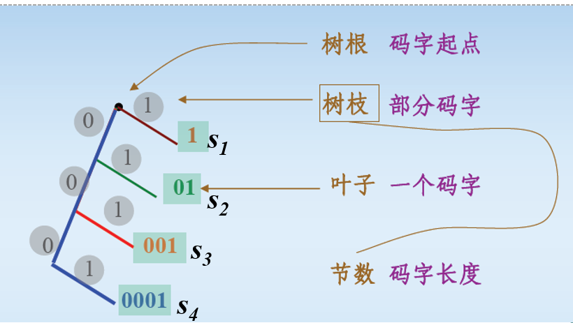
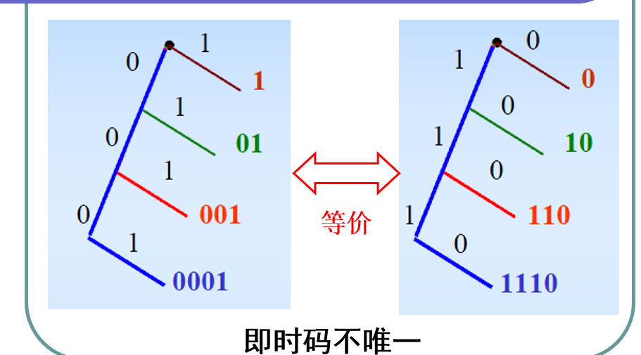
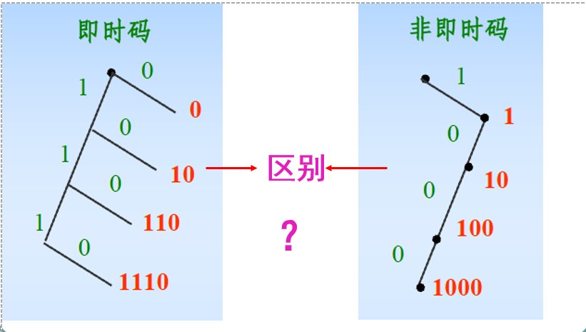

# 克拉夫特不等式
克拉夫特不等式描述了信源和码字长度应该符合什么样的关系才能形成即时码
\[
\sum_{i=1}^q r^{-l_i} \le 1
\]
也就是说，对于每个码字，计算其码元基数的负码字长度次方再求和，如果结果小于等于1，则有可能形成即时码
注意，这个公式算是必要不充分条件，也就是说，符合上述条件的不一定是即时码，但是不符合上述条件的一定不是即时码
# Sardinas-Patterson算法
## 唯一可译变长码的判断准测
假设有一个信号，能被下图这样拆成两个码字序列：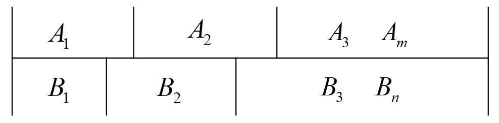
首先在定义上，这不是唯一可译码，我们接下来再看看其特征
因为信号是完全一样的，那么$B_1$的整个就是$A_1$的前端部分，也就是其前缀，而在$A_1$中不在$B_1$中的部分，我们称其为尾随后缀，则是$B_2$的前缀……以此类推，当但是到了整个序列结尾的地方，A B码字集合都在同一个位结束，这意味着不在有尾随后缀，那么A中的最后一个码字和B中的最后一个码字一定是一个是另一个子集的关系，这就意味着：这个序列一定是以码字结尾的（比如上图，假设$A_m$是$B_m$的子集，我们就知道这个序列是以码字$A_m$结尾的，别忘了$B_m$也是以码字$A_m$结尾的）
所以，我们拥有了一个理论：将码C中所有可能的尾随后缀组成一个集合F，当且仅当集合F中没有包含任一码字，便可判断此码C为唯一可译变长码

## S-P算法
- 将码字集合C的所有码字两两比对，按照前面的规则保存尾随后缀到新的集合W
- 接下来，将所有元码字和W各取一个进行配对，看看还有没有生成新的尾随后缀，如果有，则将其加入W
- 最后看W中有没有完整码字（和C是否有交集），如果有，则说明不是唯一可译变长码，反之则是
  
# 唯一可译定长码的判断条件
- 定长码因为码字长度相等，所以定长码只要是非奇异码，就是唯一可译码
- 对于简单信源S的定长编码，只要符合：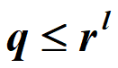就是唯一可译码，其中q是符号个数，r是码元种类，l是码长
- 进一步思考，对于简单信源的定长编码，信源符合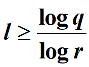时，存在唯一可译定长吗，其中q是信源的最大熵，r是码元的最大熵
  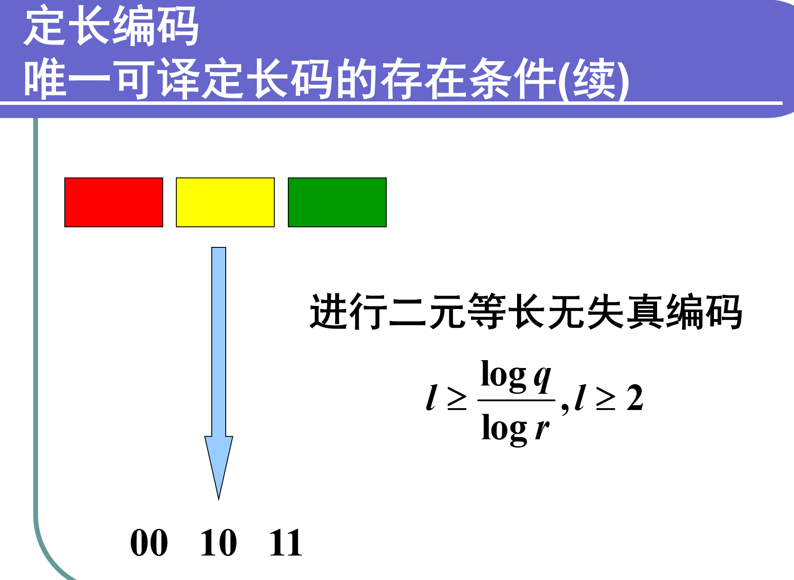
# n次扩展信源的唯一可译定长码判断条件
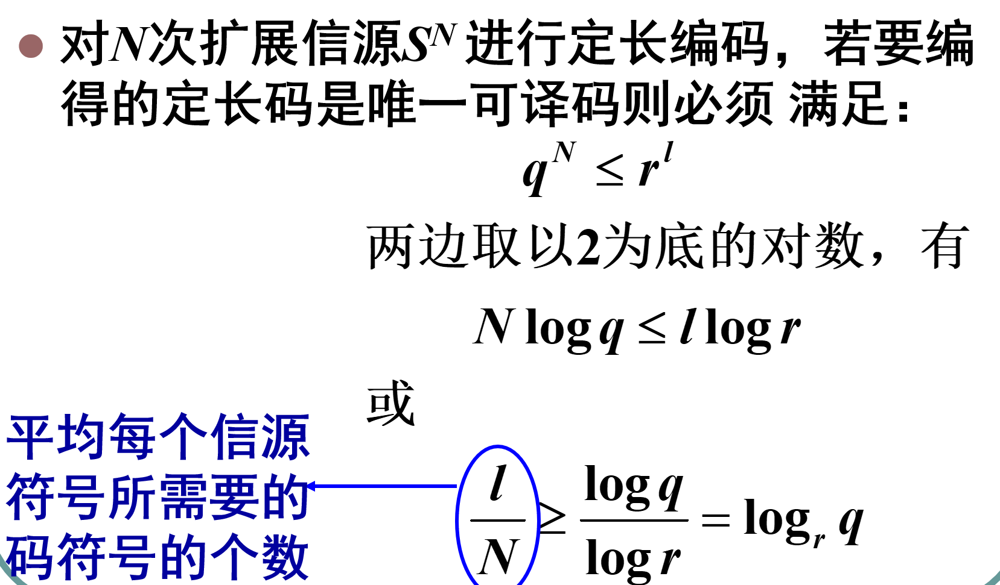

# 定长信源编码定理
假设离散无记忆信源的熵是H(X)其模型为

$$\begin{bmatrix}S \\P\end{bmatrix}=\begin{bmatrix}s_1 & s_2 & \dots & s_q \\p(s_1) & p(s_2) & \dots & p(s_q)\end{bmatrix}$$
其N次扩展信源为：
$$\begin{bmatrix}S^N \\P\end{bmatrix}=
\begin{bmatrix}
\alpha_1 & \alpha_2 & \dots & \alpha_{q^N} \\
p(\alpha_1) & p(\alpha_2) & \dots & p(\alpha_{q^N})
\end{bmatrix}
$$

对于一个N次扩展信源进行定长l的编码 其中r是码元种类，$\varepsilon$是任意小的整数
若 $\frac{l}{N} \ge \frac{H(S)+\varepsilon}{\log r}$，则可实现$\varepsilon$内几乎无失真编码；
若 $\frac{l}{N} \le \frac{H(S)-2\varepsilon}{\log r}$，则不可能实现无失真编码
将公式变化得到：$$logrl > NH(S)$$
这个变化后的结果意味着：
信源经过定长编码后，所能携带的最大信息量，一定要大于信源所携带平均信息量（熵）

# 编码效率
## 编码信息率
设熵为H(S)的离散无记忆信源，若对信源的长为N的符号序列进行定长编码，设码字是从r个码符号集中选取l个码元构成，定义$$\frac{1}{N} logr= R`$$表示编码过后每个码元能载荷的最大信息量，称为**编码信息率**
## 编码效率
编码效率的公式是：$$\mu = \frac{H(S)}{R`}$$表示编码效率其中，编码效率的值一定小于等于1
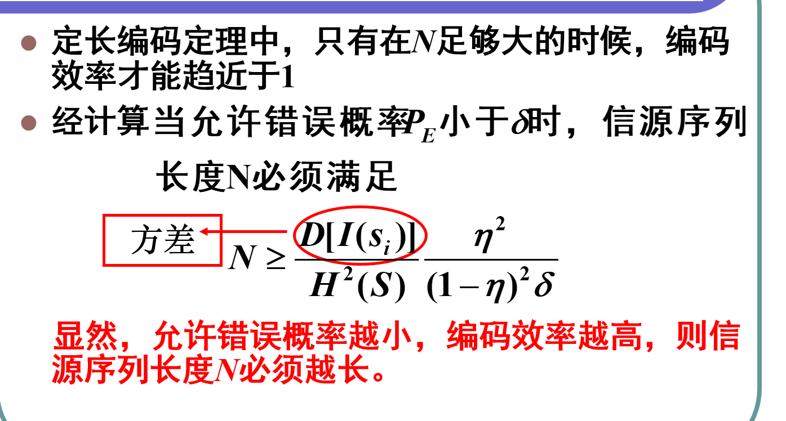

# 变长编码
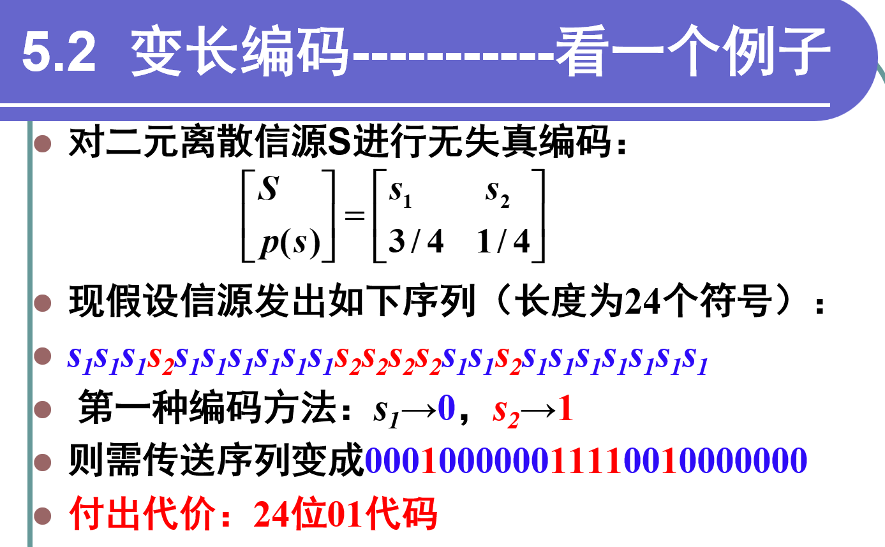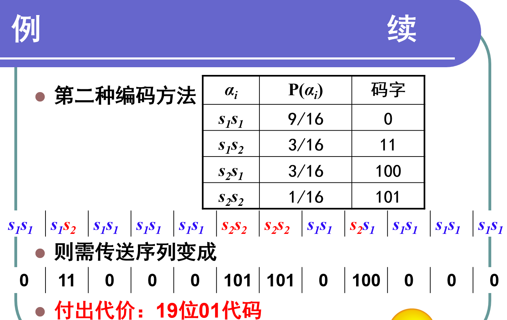
在变长方案中，我们将原来的信源作二次扩展作为码元，并按照实际情况计算出每组信号发生的概率，尝试用更短的码元来代表发生概率更高的信号（分配码字的具体过程参考后续的霍夫曼编码）
可见，变长编码在这个情景之下的效率会更高一点
## 平均码长
既然提到了编码是变长的，那么我们就会研究码长的平均值
定义一个信源$$\left[\begin{array}{c} S \\ P \end{array}\right] = \left\{ \begin{array}{cccc} s_1 & s_2 & \cdots & s_q \\ p(s_1) & p(s_2) & \cdots & p(s_q) \end{array} \right\}$$，假设编码之后的码字是$W_i$  长度是$l_i$ ，
则我们将$\overline{L} = \sum_{i=1}^{q} p(s_i) l_i$称为编码的平均码长
(也就是每个码长按照对应码元发生概率进行加权平均)
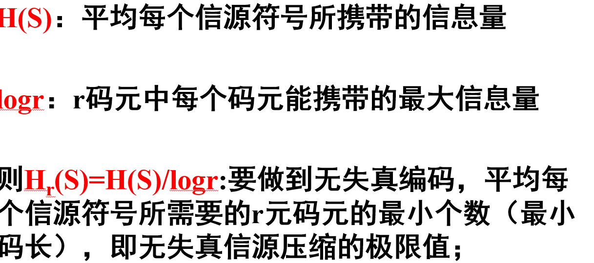
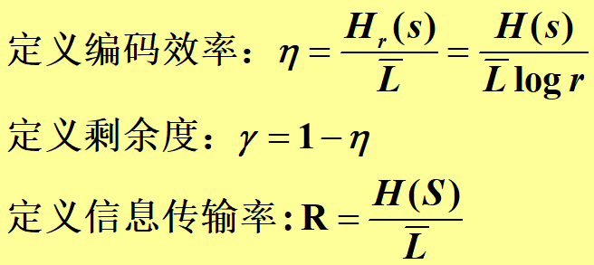
## 最佳平均码长
对于某一信源和某一码符号集来说，若有一个唯一可译码，其平均长度$\overline{L}$小于所有其它唯一可译码的平均长度，则称该码为紧致码，或最佳码
定理：若有一个离散无记忆信源S具有熵为H(S),并有r个码元的码符号，则总可以找到一种无失真编码方法，构成唯一可译码，使其平均码长满足：
