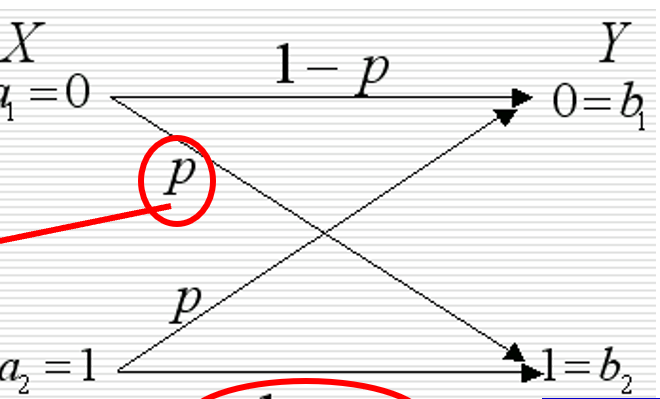
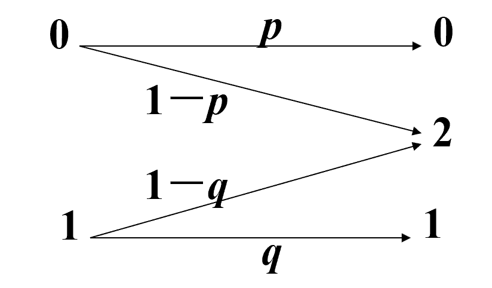

信道是从信息发送端到其接收端的桥梁
信道的任务：以信息的方式传输和容纳信息
另外 我们会发现后面的内容和信源对输入信息和输出信息的处理逻辑相似，实际上，信源和信道共同作用，才构成了整个信息传输的过程
# 信道的分类
## 按信道的用户多少：
- 两端/单用户信道：只有一个输入和一个输出的信道
- 多端/多用户信道：有多个输入和多个输出的信道
## 根据信道的记忆特性
- 无记忆信道：输出仅和当前的输入有关，和过去的输入无关
- 有记忆信道：信道输出不仅和当前输入有关，还和过去输入或过去的输出有关
## 按信道的参数和时间的关系
- 恒参信道：信道的统计特性不随时间变化
- 随参信道：信道的统计特性随时间变化
## 按输入和输出信号的特点
- 离散信道：输入，输出随机变量都取离散值
- 连续信道：输入，输出随机变量都取连续值
- 半离散或半连续信道：输入或输出中一个为离散值而另一个为连续值
- 波形信道：输入和输出随机变量都取连续值，且随时间连续变化

之后的文字，我们只研究无反馈 固定参数的单用户离散信道

# 信道的数学模型
## 离散信道的数学模型
假设离散信道的输入空间A = {$a_1,a_2,……,a_r$},相应的概率是$p_i$
输出空间A = {$b_1,b_2,……,b_r$},相应的概率是$q_i$
那么在这个条件下，假设离散信道的输入序列为：$$X = \{X_1, X_2, \dots, X_N\},\ X_i \in A,\ 1 \le i \le N$$
输出序列为$$Y = \{Y_1, Y_2, \dots, Y_N\},\ Y_i \in B,\ 1 \le i \le N$$
信道特性(也就是如何把输入处理成输出的过程)就可以用以下转移概率来描述
\[
p(y \mid x) = p(y_1 y_2 \cdots y_N \mid x_1 x_2 \cdots x_N)
\]
信道的数学模型就可以表示成
\[
\{X,\ p(y \mid x),\ Y\}
\]
也就是 输入空间，x条件下输出y的概率 输出空间三个元素

## 离散信道的分类
根据信道的统计特性，也就是中间条件概率的区别，我们将离散信道分成下面三类
- 无干扰信道：信道中没有随机性的干扰或干扰很小，输出的信号Y和输入信号X有明确的 一一对应的关系（只要你输入这个，就一定输出那个）
- 有干扰无记忆信道：信道输入和输出之间的条件概率是一般的概率分布，但任意时刻输出符号只统计依赖于对应时刻的输入符号，即为无记忆信道（对于输入的内容固定的情况，信道会输出什么收到概率影响，并不是一一对应的，而这种概率不会因为之前的输入输出而被影响，所以称为无记忆信道）
- 有干扰有记忆信道:在干扰信道的基础上，其本次输出的内容会受到之前几次输入信号和输出信号的内容影响(我们通常采用转化成无记忆信道或有限记忆信道的方式来处理)
  
## 单符号离散信道的数学模型
## 单符号离散信道
输入随机变量为$X$，其取值为$x$，$x \in A = \{a_1, a_2, \dots, a_r\}$

输出随机变量为$Y$，其取值为$y$，$y \in B = \{b_1, b_2, \dots, b_s\}$

信道传递概率为
\[
p(y|x) = p(y = b_j \mid x = a_i) = p(b_j \mid a_i)
\]
其中 $i = 1,2,\dots,r; \ j = 1,2,\dots,s$。

信道的传递概率又称为转移概率，它是一个条件概率，且
\[
p(b_j \mid a_i) > 0, \quad i=1,2,\dots,r; \ j=1,2,\dots,s
\]
\[
\sum_{j=1}^s p(b_j \mid a_i) = 1, \quad i=1,2,\dots,r
\]
即当x固定时，发生所有y的概率的总和，就是1
### 信号转移矩阵
我们将所有情况的概率分布以一种更加直观的方式：矩阵展现出来
\[
    P = \begin{bmatrix}
    p(b_1|a_1) & \dots & p(b_s|a_1) \\
    \vdots & \ddots & \vdots \\
    p(b_1|a_r) & \dots & p(b_s|a_r)
    \end{bmatrix}
    \]
我们可以将这个矩阵理解为输入空间A和输出空间B这两个单行矩阵相乘运算的结果
每一行表示了在输入信号确定的情况下，输出一种输出信号的概率
这种矩阵满足：
- 非负性：矩阵内所有元素的值都是非负的
- 行归一性：矩阵内所有行的元素的和都是1
### 例题
#### 二元对称信道：
输入符号集和输出符号集都是{0,1}的信道，传递概率如下：

转移矩阵是多少
[答案](./例题1.md)
#### 二元删除信道
依旧根据传递概率总结转移矩阵

# 信道疑义度和平均互信息
我们将研究离散单符号信道的数学模型下的信息传输问题
## 离散信道中的一般概率关系
我们在这里将这个传输过程的概率联系起来：
- 信源侧的先验概率：即信源的产生信号的概率分布 输入随机变量为$X$，其取值为$a_i \in A = \{a_1,a_2,\dots,a_r\}$，先验概率为：
\[
p(a_i) = P(X = a_i), \quad i=1,2,\dots,r
\]
- 前向概率：也就是信道转移概率，前向概率描述信道的噪声特性，即输入为$a_i$时输出为$b_j$的条件概率（信息在信道转移过程中有没有因为一些因素发生改变）：
\[
p(b_j \mid a_i) = P(Y = b_j \mid X = a_i)
\]
- 输出符号概率，即接收端观测到的信息是信道传来的信息的概率（接收端看到的东西会是什么，若信道输出的信息是a，则在这个条件下接收端看到其他信息的概率）
\[
p(b_j) = P(Y = b_j) = \sum_{i=1}^r p(a_i) p(b_j \mid a_i)
\]
- 后向概率：接收端在收到来自信道的信号后，判断结果和信道传输的内容一致的概率（没错 在接收端观测到来自信道的信息之后，还需要对这个观测结果进行辨认和解码）：
\[
    p(a_i \mid b_j) = P(X = a_i \mid Y = b_j)
    \]
也就是说 信息的整个传输过程 就是先验-前向-信道转移-输出-后向的顺序 每个概率都代表一个节点

# 信道疑义度
