信道是从信息发送端到其接收端的桥梁
信道的任务：以信息的方式传输和容纳信息
另外 我们会发现后面的内容和信源对输入信息和输出信息的处理逻辑相似，实际上，信源和信道共同作用，才构成了整个信息传输的过程
# 信道的分类
## 按信道的用户多少：
- 两端/单用户信道：只有一个输入和一个输出的信道
- 多端/多用户信道：有多个输入和多个输出的信道
## 根据信道的记忆特性
- 无记忆信道：输出仅和当前的输入有关，和过去的输入无关
- 有记忆信道：信道输出不仅和当前输入有关，还和过去输入或过去的输出有关
## 按信道的参数和时间的关系
- 恒参信道：信道的统计特性不随时间变化
- 随参信道：信道的统计特性随时间变化
## 按输入和输出信号的特点
- 离散信道：输入，输出随机变量都取离散值
- 连续信道：输入，输出随机变量都取连续值
- 半离散或半连续信道：输入或输出中一个为离散值而另一个为连续值
- 波形信道：输入和输出随机变量都取连续值，且随时间连续变化

之后的文字，我们只研究无反馈 固定参数的单用户离散信道

# 信道的数学模型
## 离散信道的数学模型
假设离散信道的输入空间A = {$a_1,a_2,……,a_r$},相应的概率是$p_i$
输出空间A = {$b_1,b_2,……,b_r$},相应的概率是$q_i$
那么在这个条件下，假设离散信道的输入序列为：$$X = \{X_1, X_2, \dots, X_N\},\ X_i \in A,\ 1 \le i \le N$$
输出序列为$$Y = \{Y_1, Y_2, \dots, Y_N\},\ Y_i \in B,\ 1 \le i \le N$$
信道特性(也就是如何把输入处理成输出的过程)就可以用以下转移概率来描述
\[
p(y \mid x) = p(y_1 y_2 \cdots y_N \mid x_1 x_2 \cdots x_N)
\]
信道的数学模型就可以表示成
\[
\{X,\ p(y \mid x),\ Y\}
\]
也就是 输入空间，x条件下输出y的概率 输出空间三个元素

## 离散信道的分类
根据信道的统计特性，也就是中间条件概率的区别，我们将离散信道分成下面三类
- 无干扰信道：信道中没有随机性的干扰或干扰很小，输出的信号Y和输入信号X有明确的 一一对应的关系（只要你输入这个，就一定输出那个）
- 有干扰无记忆信道：信道输入和输出之间的条件概率是一般的概率分布，但任意时刻输出符号只统计依赖于对应时刻的输入符号，即为无记忆信道（对于输入的内容固定的情况，信道会输出什么收到概率影响，并不是一一对应的，而这种概率不会因为之前的输入输出而被影响，所以称为无记忆信道）
- 有干扰有记忆信道:在干扰信道的基础上，其本次输出的内容会受到之前几次输入信号和输出信号的内容影响(我们通常采用转化成无记忆信道或有限记忆信道的方式来处理)
  
## 单符号离散信道的数学模型
## 单符号离散信道
输入随机变量为$X$，其取值为$x$，$x \in A = \{a_1, a_2, \dots, a_r\}$

输出随机变量为$Y$，其取值为$y$，$y \in B = \{b_1, b_2, \dots, b_s\}$

信道传递概率为
\[
p(y|x) = p(y = b_j \mid x = a_i) = p(b_j \mid a_i)
\]
其中 $i = 1,2,\dots,r; \ j = 1,2,\dots,s$。

信道的传递概率又称为转移概率，它是一个条件概率，且
\[
p(b_j \mid a_i) > 0, \quad i=1,2,\dots,r; \ j=1,2,\dots,s
\]
\[
\sum_{j=1}^s p(b_j \mid a_i) = 1, \quad i=1,2,\dots,r
\]
即当x固定时，发生所有y的概率的总和，就是1
### 信号转移矩阵
我们将所有情况的概率分布以一种更加直观的方式：矩阵展现出来
\[
    P = \begin{bmatrix}
    p(b_1|a_1) & \dots & p(b_s|a_1) \\
    \vdots & \ddots & \vdots \\
    p(b_1|a_r) & \dots & p(b_s|a_r)
    \end{bmatrix}
    \]
我们可以将这个矩阵理解为输入空间A和输出空间B这两个单行矩阵相乘运算的结果
每一行表示了在输入信号确定的情况下，输出一种输出信号的概率
这种矩阵满足：
- 非负性：矩阵内所有元素的值都是非负的
- 行归一性：矩阵内所有行的元素的和都是1
### 例题
#### 二元对称信道：
输入符号集和输出符号集都是{0,1}的信道，传递概率如下：

转移矩阵是多少
[答案](./例题1.md)
#### 二元删除信道
依旧根据传递概率总结转移矩阵

# 信道疑义度和平均互信息
我们将研究离散单符号信道的数学模型下的信息传输问题
## 离散信道中的一般概率关系
我们在这里将这个传输过程的概率联系起来：
- 信源侧的先验概率：即信源的产生信号的概率分布 输入随机变量为$X$，其取值为$a_i \in A = \{a_1,a_2,\dots,a_r\}$，先验概率为：
\[
p(a_i) = P(X = a_i), \quad i=1,2,\dots,r
\]
- 前向概率：也就是信道转移概率，前向概率描述信道的噪声特性，即输入为$a_i$时输出为$b_j$的条件概率（信息在信道转移过程中有没有因为一些因素发生改变）：
\[
p(b_j \mid a_i) = P(Y = b_j \mid X = a_i)
\]
- 输出符号概率，即接收端观测到的信息是信道传来的信息的概率（接收端看到的东西会是什么，若信道输出的信息是a，则在这个条件下接收端看到其他信息的概率）
\[
p(b_j) = P(Y = b_j) = \sum_{i=1}^r p(a_i) p(b_j \mid a_i)
\]
- 后向概率：接收端在收到来自信道的信号后，判断发送方原本发送的信号是$a_i$的概率（没错 在接收端观测到来自信道的信息之后，还需要对这个观测结果进行辨认和解码）：
\[
    p(a_i \mid b_j) = P(X = a_i \mid Y = b_j)
    \]
也就是说 信息的整个传输过程 就是先验-前向-信道转移-输出-后向的顺序 每个概率都代表一个节点

# 信道疑义度
信道疑义度也被称为损失熵，记作H(X|Y)
由于传输过程中噪声等干扰因素的存在，我们无法保证到手的信息就是当时发送者发出的信息，所以我们要根据已有的信息，评估发送方发送每个信号的可能的概率
我们可以和信源熵一起理解，信源熵就是我们在什么都没收到时，推断发送方发送所有可能的信号的平均概率，而信道疑义度就是我们在知道本次信号发送的结果后，再计算发送方当初发送的信息的平均概率（我们在明确收到的信息后，不确定性会减少，但不会降低到0）
## 计算公式
\[
H(X\mid Y) = \sum_{i=1}^r \sum_{j=1}^s p(a_i b_j) \log_2 \frac{1}{p(a_i\mid b_j)}
\]
就是在收到输入$b_j$后，反向推断输出信号是$a_i$的概率，最后取加权平均值
即：通过后验概率计算其可能性，然后利用联合概率计算其加权平均值和
推理过程如下
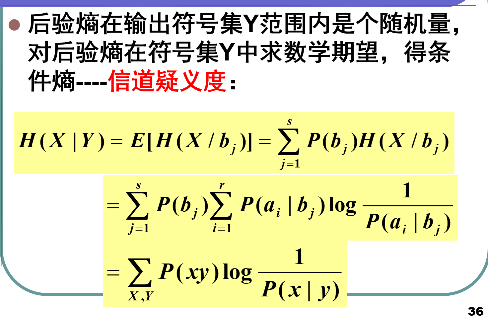

# 互信息量和平均互信息
在我们收到消息$y_i$后，对于原始的输入符号$x_i$你知道了多少信息
互信息表示先验的不确定性减去现存的不确定性，这就是收信者获得的信息量，互信息可以是负值，表示为$$I(x_i;y_j) = I(x_i) - I(x_i|y_j)$$
推导公式如下：
\[
\begin{aligned}
I(x_i; y_j) &= I(x_i) - I(x_i | y_j) \\
&= -\log{p(x_i)} + \log{p(x_i | y_j)} \\
&= \log \frac{p(x_i | y_j)}{p(x_i)}
\end{aligned}
\]
其实就像前面说的，就是x的信息量减去y的条件下发生x的信息量SS
同时 对于全无干扰信道，你收到了一个特定的信号，就一定能知道发送时的信号是哪个，所以就直接得到发送信号的信息，即：$$I(x_i; y_j) = I(x_i)$$
而对于全损信道，则你收到什么都不会得到发出的信道的信息，即$$I(x_i; y_j) = 0$$

## 平均互信息
平均互信息表示所有信息量情况的统计平均，代表接收到的符号集Y后平均每个符号关于X的信息量，表示为：I($X$:$Y$)
计算公式可以简单理解为，所有x y组合的互信息量按照发生概率作为权重的加权平均值

\[
\begin{aligned}
I(X;Y) &= \sum_{j} \sum_{i} p(x_i y_j) I(x_i;y_j) \\
&= \sum_{j} \sum_{i} p(x_i y_j) \log \frac{p(x_i|y_j)}{p(x_i)}
\end{aligned}
\]

### 平均互信息的另一种表达方式
平均互信息还可以理解为原始信源熵和信道疑义度的查，也就是接收到输出符号集Y后，平均每个符号获得的关于X的信息$$I(X;Y) = H(X) - H(X|Y)$$
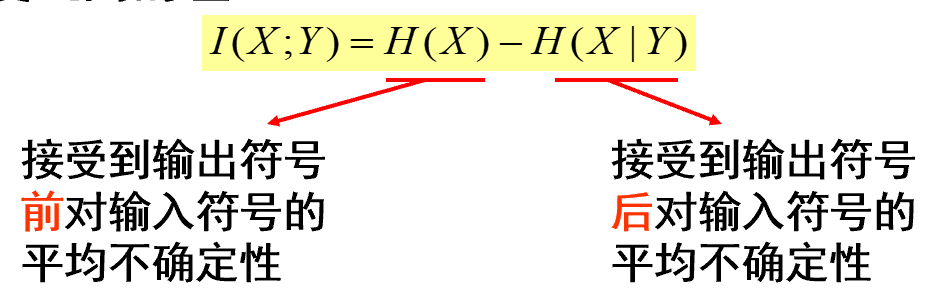
这里得到的是一个长期的，整体的性能，所以理解为平均
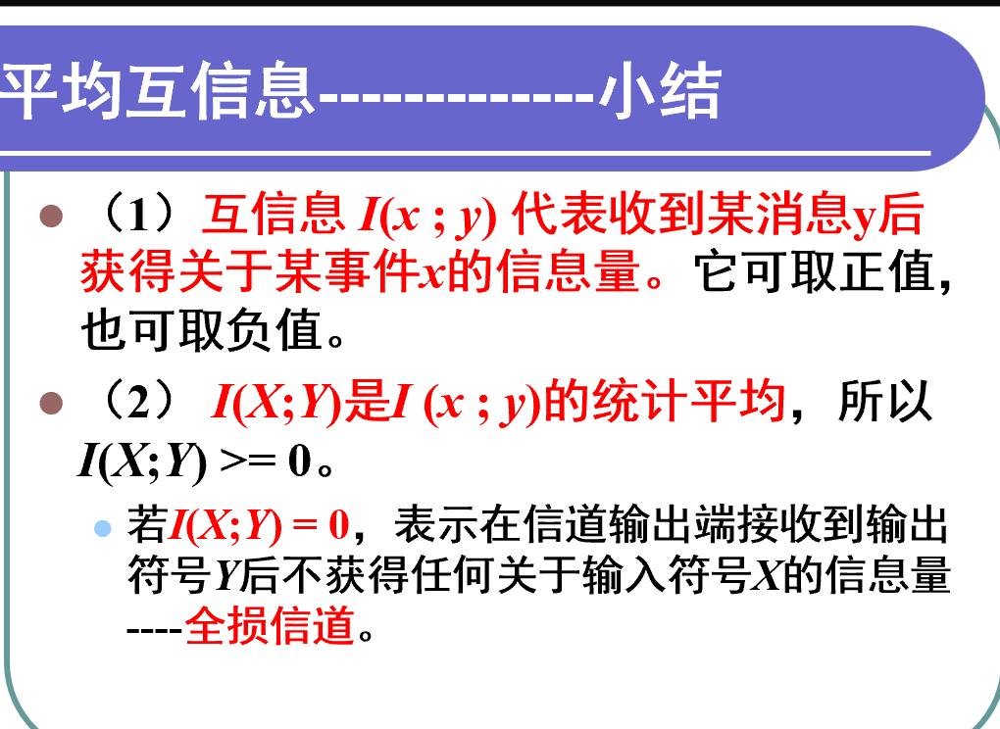
$$I(X;Y) = H(X) - H(X|Y)$$
收到Y后获得的关于X的平均信息

$$I(X;Y) = H(Y) - H(Y|X)$$
互信息对称形式

$$I(X;Y) = H(X) + H(Y) - H(XY)$$
联合熵表示的互信息
$H(X) = \sum_{x} p(x) \log_2 \frac{1}{p(x)}$$
输入信源熵

$$H(Y) = \sum_{y} p(y) \log_2 \frac{1}{p(y)}$$
输出边缘熵

$$H(X|Y) = \sum_{x,y} p(xy) \log_2 \frac{1}{p(x|y)}$$
信道疑义度

$$H(Y|X) = \sum_{x,y} p(xy) \log_2 \frac{1}{p(y|x)}$$
噪声熵

$$H(XY) = \sum_{x,y} p(xy) \log_2 \frac{1}{p(xy)}$$
联合熵
### 维拉图看平均互信息，熵的关系
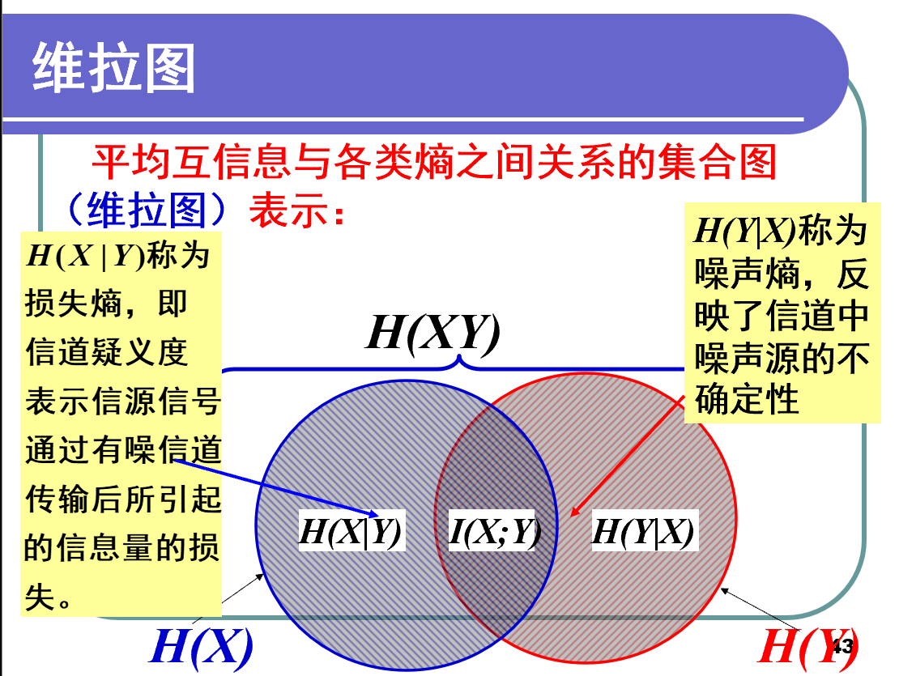
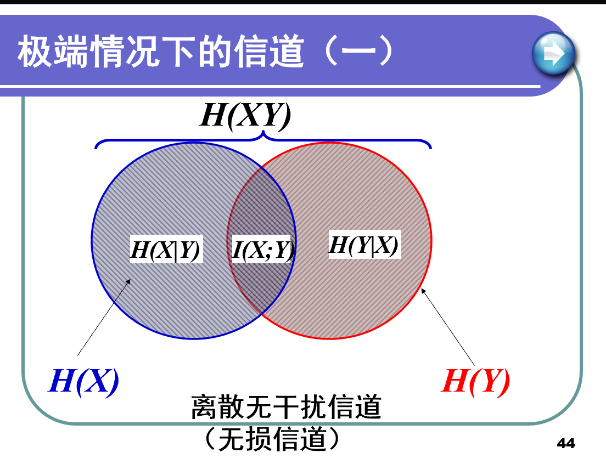
离散无干扰的信道下，损失熵和噪声熵都是0 不会对信息发生改变，着就意味着输出端接收的信息就是平均互信息
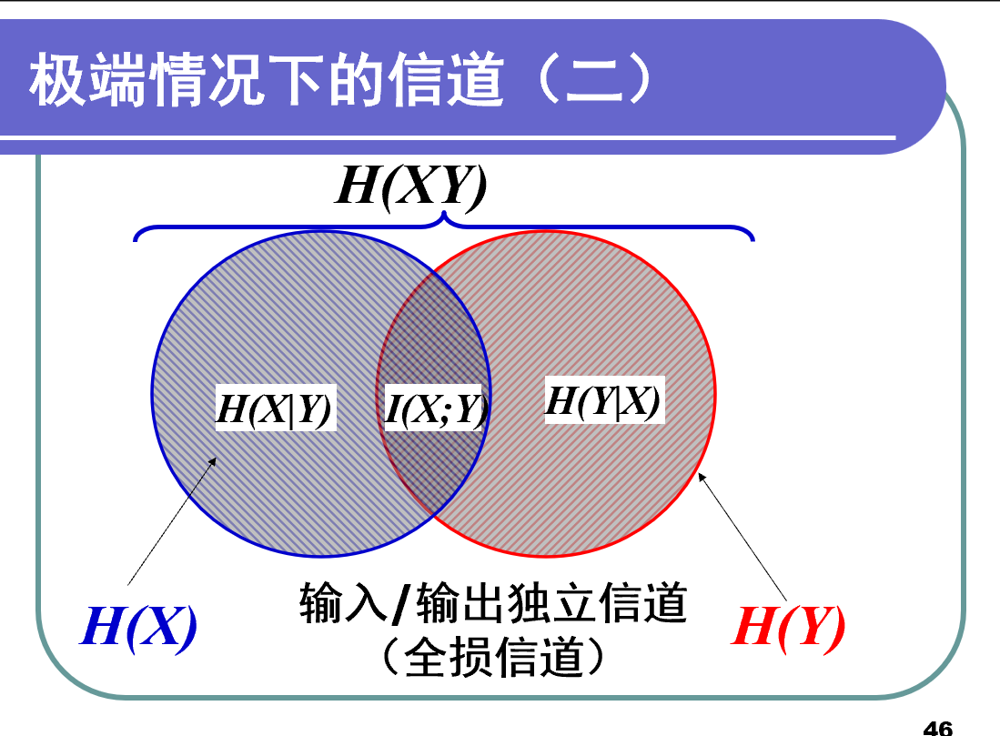
全损信道下，输入端x和输出端y的统计完全独立，也就是输入什么和输出什么完全不沾边，也就意味着平均互信息等于0，无法得到任何信息，信道两端随机变量的统计约束程度等于0
### 平均互信息的性质
#### 非负性
因为$H(X|Y)小于等于H(X)$再根据平均互信息的计算公式，我们能知道一个信道总能传递一些信息，肯定不会抢走你的信息，也就是平均互信息一定是非负的
#### 极值性
一般来说，信道的疑义度总是大于0所以互信息总是小于等于信源的熵，当信道是无损信道时，互信息才会等于信源的熵
#### 互易性
也叫对称性 就是$I(X|Y) = I(Y|X)$
出现这种现象是因为x到y算一种映射，事实是一样的，但是观察者的位置不同，测度名称就会不同，但本质上测的是一个东西
#### 凸状性
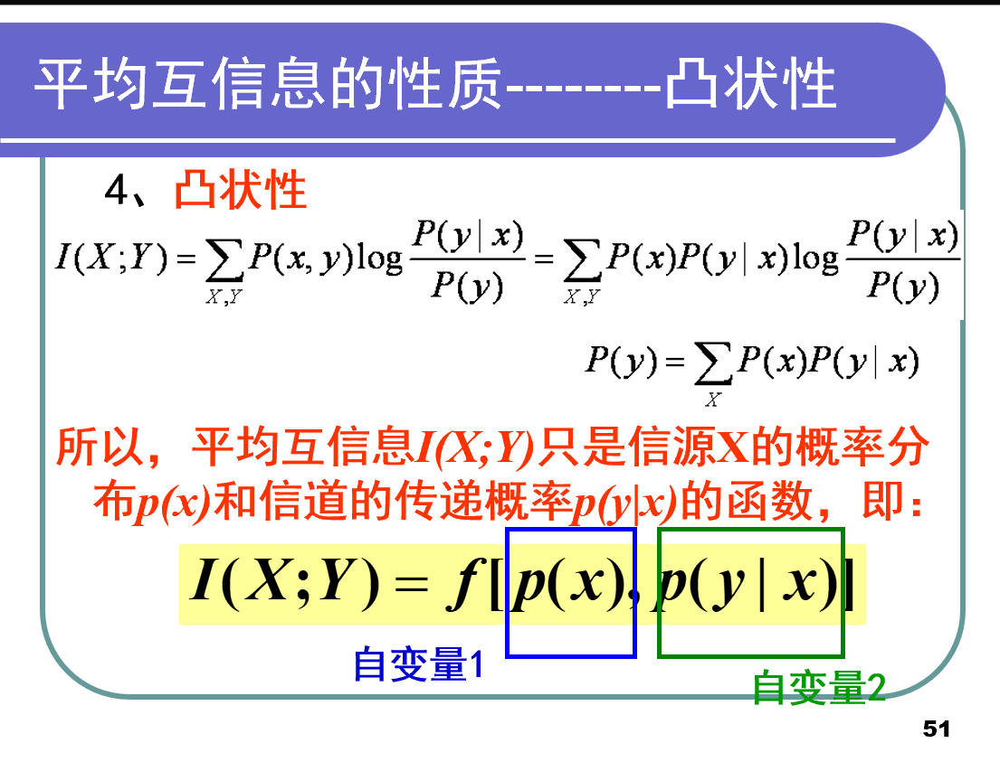
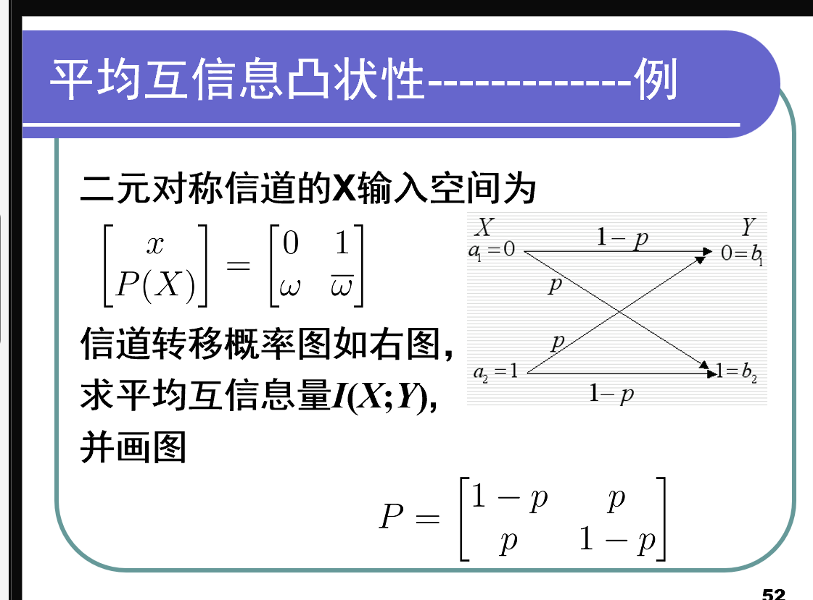
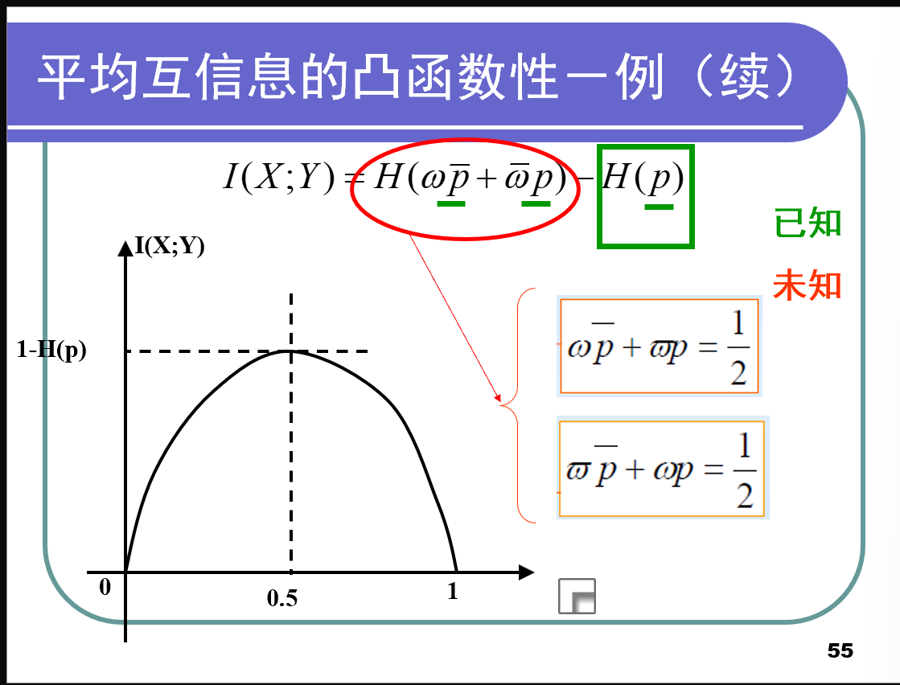
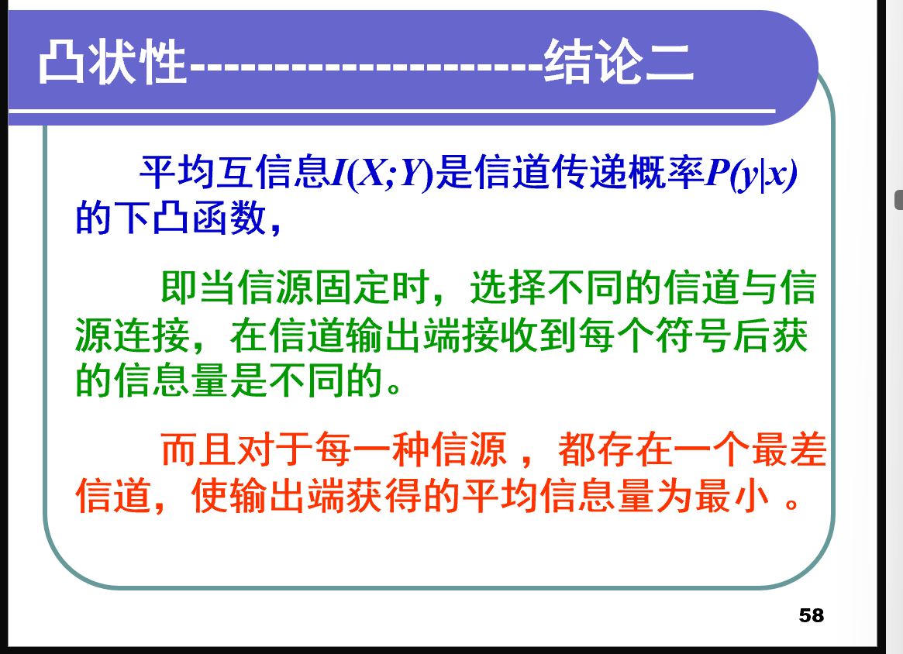

# 离散信道的信道容量
## 信道容量的定义
信道容量定义为平均互信息大队输入概率分布的最大值，表示的是信道传输信息的最大能力
$C=max_{p(x)}​I(X;Y)$
- X：信道输入随机变量
- Y：信道输出随机变量
- I(X;Y)：**输入与输出的平均互信息**
- p(x)max​：遍历所有可能的输入信号概率分布，取互信息的最大值
单位为bit/symbol或奈特/symbol
由于平均互信息是输入变量x的概率分布p(x)的上凸函数，获得信道容量时，对应的输入概率分布就是最佳输入分布
## 信道容量的第二种表示
如果我们知道平均每传输一个符号需要t秒钟，则信道在单位时间内平均传输的最大信息量为$$C_t = \frac{1}{C}$$
这也是信道容量的一种表示方法

## 简单离散信道的信道容量
### 无噪无损信道
输入和输出是有确定的一一对应关系的信道，这样转移概率矩阵很干净，规则很明确
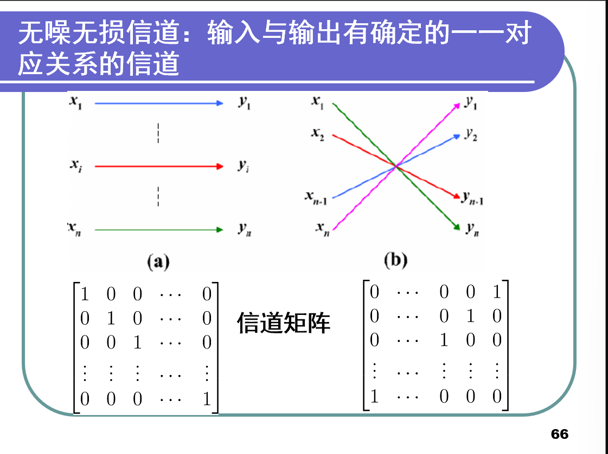
#### 信道容量
\[
P(b_j \mid a_i) = P(a_i \mid b_j) =
\begin{cases}
0 & i \neq j \\
1 & i = j
\end{cases}
\]
所以这类信道的噪声熵和损失熵都是0
 \[
    H(Y|X) = 0, \quad H(X|Y) = 0
    \]
所以平均互信息为
    \[
    I(X;Y) = H(X) = H(Y)
    \]
    
则信道容量为
    \[
    \begin{aligned}
    C &= \max_{P(x)} H(X) = \max_{P(y)} H(Y) \\
    &= \log r = \log s \quad (\text{bit/symbol})
    \end{aligned}
    \]
所以计算平均互信息就是

### 有噪无损信道
输入一个x值对应有几个输出Y值，但是输入不同的x值，不会输出相同的y值
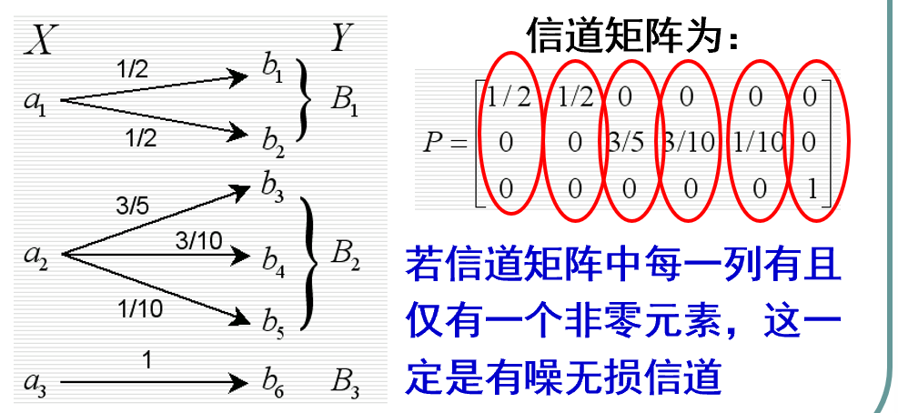
也就是说 发的时候不知道你会收到什么 但你无论收到什么 一定知道我发了什么
其后向概率的公式是这样的：\[
p(a_i \mid b_j) =
\begin{cases}
0 & b_j \notin B_i \\
1 & b_j \in B_i
\end{cases}
\]
所以得到其损失熵为0 噪声熵不等于0
所以其平均互信息$$I(X;Y) = H(X) < H(Y)$$
则其信道容量为：
\[
C = \max_{P(x)} H(X) = \log r \quad \text{bit/symbol}
\]r指输入符号数

### 无噪有损信道
正好和前面一个反过来，这里指的是信道的一个输出对应着多个互不相交的输入
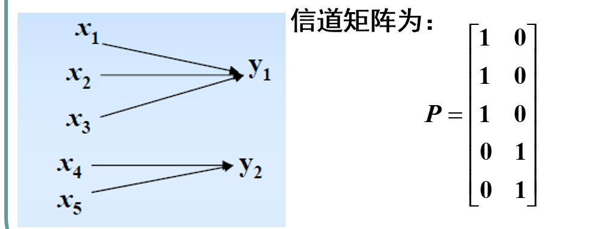
所以其噪声熵不等于0 而损失熵为0
  \[
    C = \max_{P(x)} H(Y) = \log s \quad \text{bit/symbol}
\]s指输出符号数

## 对称离散信道的信道容量
对称信道指的是信道矩阵中每行之间的元素集合都是相同的，只是排列顺序不同，每列也是这个规则，但行和列之间未必相同
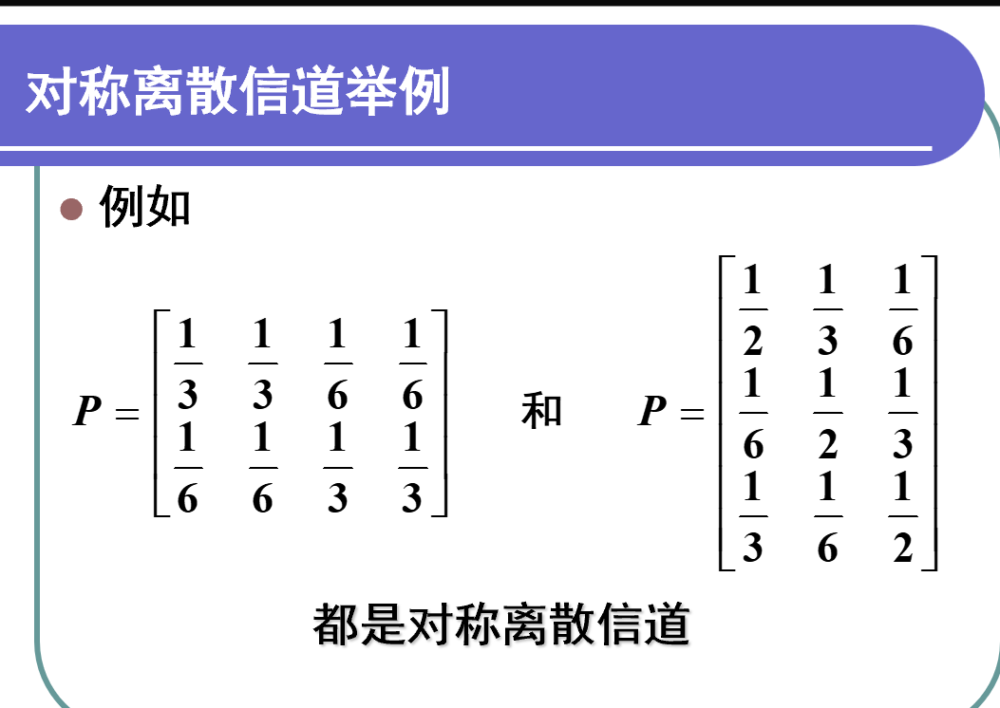
在这种情况下，我们知道噪声熵的计算和概率分布有关但和顺序无关，这就意味着无论使用哪个信号（哪行数据）进行计算，都会得到同样的结果
而对于对称离散信道，当输入为等概率分布时，达到信道容量，因为噪声熵不会再变化，则要控制输入的熵最大来让平均互信息最大，即输入为等概率分布的时候

\[
C = \log s - H(p_1', p_2', \dots, p_s') \quad (\text{比特/符号})
\]
例题：
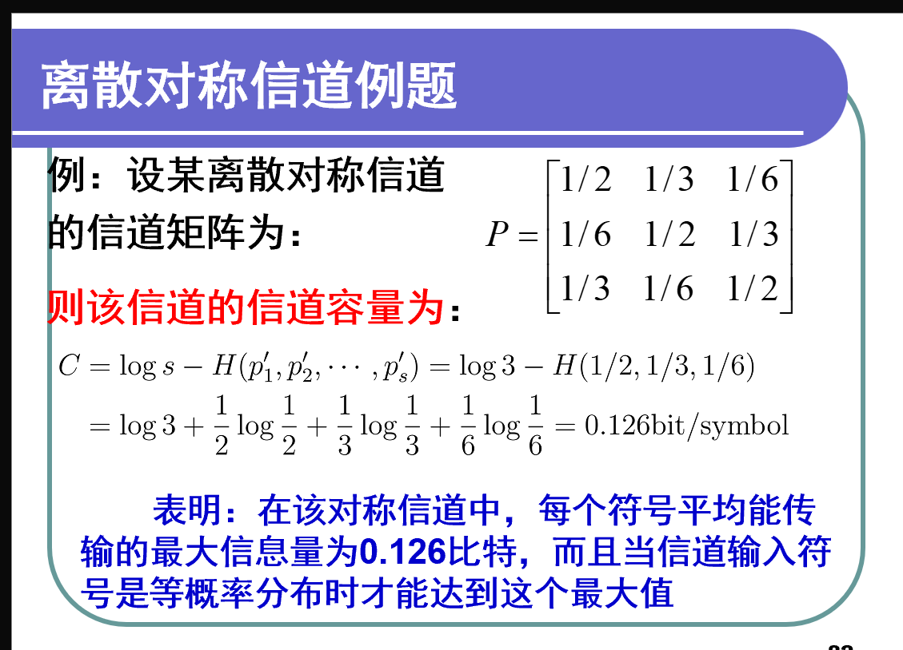
## 均匀信道（强对称信道）的信道容量
如果信道输入符号和输出符号的个数相等，而且信道矩阵为：
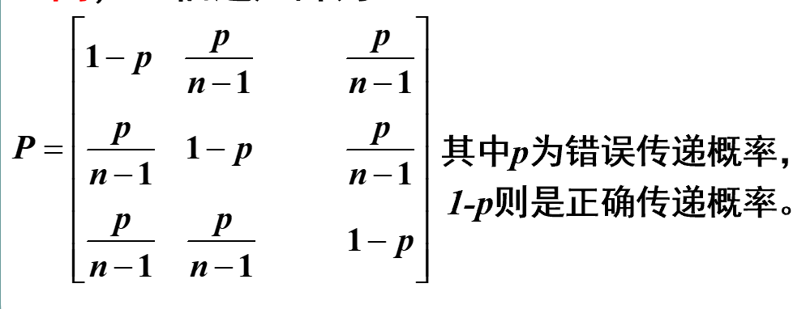
我们称这种信道为强对称信道或均匀信道
- 均匀信道是对称信道的一个特例
- 输入符号和输出符号数总是相等的
- 信道中总的错误概率是p，对称地平均分配给n - 1个其他的输出符号，n为输出符号的个数
- 各行，各列的和是1（一般信道各个列的和不一定等于1）
- 二元对称信道就是n = 2的均匀信道

其信道容量的计算过程如下：
\[
\begin{aligned}
C &= \log n - H\left(1-p,\ \frac{p}{n-1},\ \dots,\ \frac{p}{n-1}\right) \\
&= \log n + (1-p)\log(1-p) + (n-1)\cdot\frac{p}{n-1}\log\frac{p}{n-1} \\
&= \log n + (1-p)\log(1-p) + p\log\frac{p}{n-1} \\
&= \log n - p\log(n-1) - H(p)
\end{aligned}
\]
当信道是二元对称信道时，其公式就是：\[
C = 1 - H(p) \quad (\text{bit/符号})
\]
## 准对称信道的信道容量
若一个离散无记忆信道的信道矩阵中，按照信道的输出集可以将信道划分成n各互不相交的子集/子矩阵，每个子矩阵都是对称信道的矩阵，则称这类信道为离散准对称信道
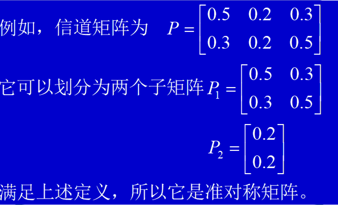
在这里，准对称信道的每一行分布还是相同的，所以噪声熵是一个常数，和输入分布无关
我们还是要最大化输出熵
所以其公式如下：
\[
C = \log r - H(p_1', p_2', \dots, p_s') - \sum_{k=1}^n N_k \log M_k
\]
其中：
- \(r\)：输入符号集的个数；
- \((p_1', p_2', \dots, p_s')\) 为准对称矩阵中任意一行的元素分布；
- 信道矩阵可划分为 \(n\) 个互不相交的列子集；
- \(N_k\) 为第 \(k\) 个子矩阵中任意一行的元素和；
- \(M_k\) 为第 \(k\) 个子矩阵中每一列的和。
## 一般离散信道的信道容量
在计算信道容量这一块，平均互信息时r个变量（r个输入值x的分布概率）的多元函数，且满足和为1，能用拉格朗日乘数法来计算这个条件极值

### 一般离散信道的信道容量定理
假设有一半离散信道，其有r个输入符号，s个输出符号，当且仅当存在常数C使得输入分布$p(a_i)$满足
- $I(a_i:Y) = C$(单个符号和输出的互信息，输入符号是固定的)
- $I(a_i;Y) \leq C$ $P(a_i) = 0$，对一切i时，xy的互信息到达极大值，此时常数C就是我们要求的信道容量

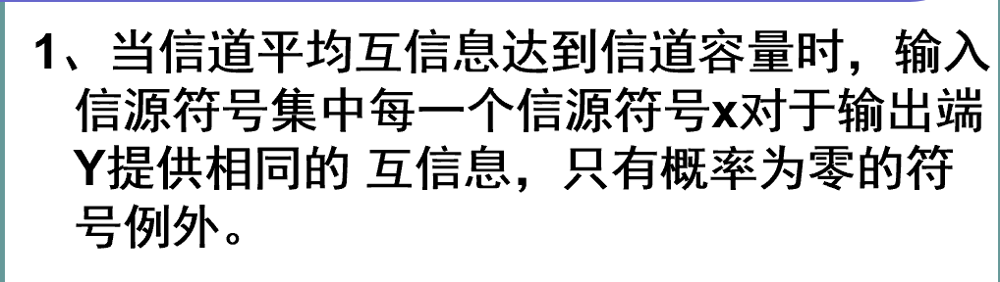
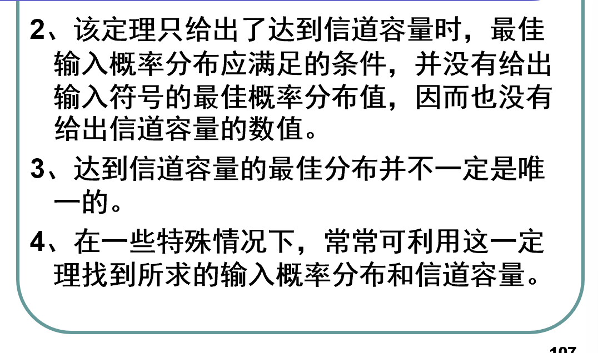
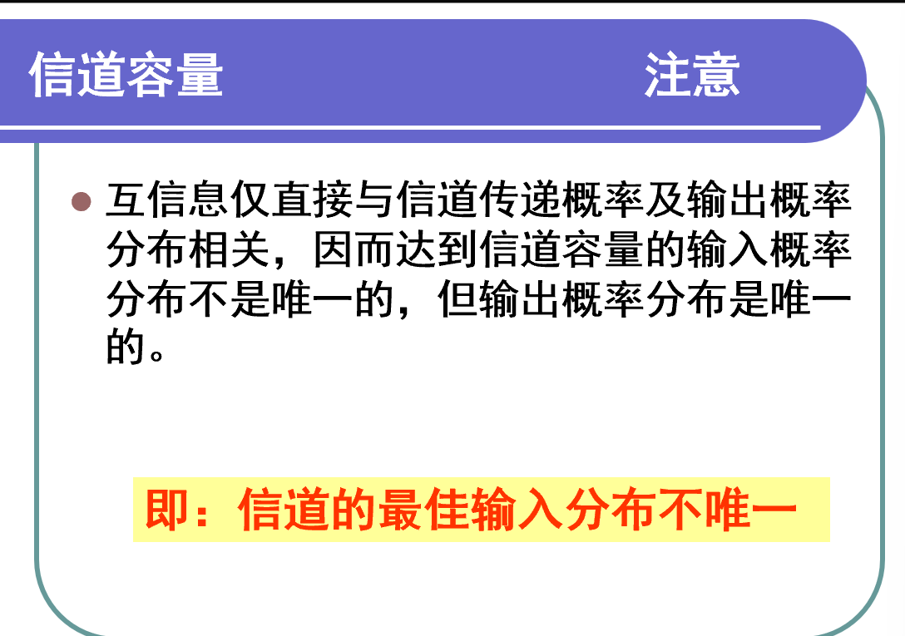

# 离散无记忆的扩展信道
一种用于表示信道被连续多次使用的模型，之前的信道都是单符号信道，一次只传一个符号，观察其在信道中的变化，而在扩展信道里，我们研究的是一次输出一个序号序列（一串信道）的情况
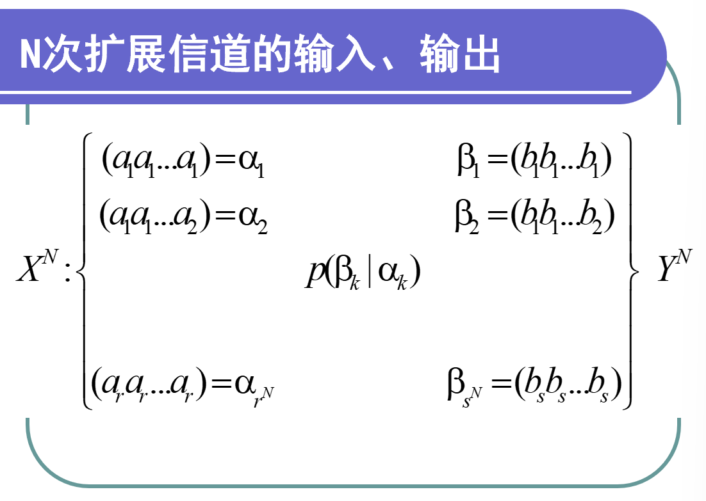
## N次扩展信道的平均互信息
在计算信号序列的基础上，按照互信息公式算就好了
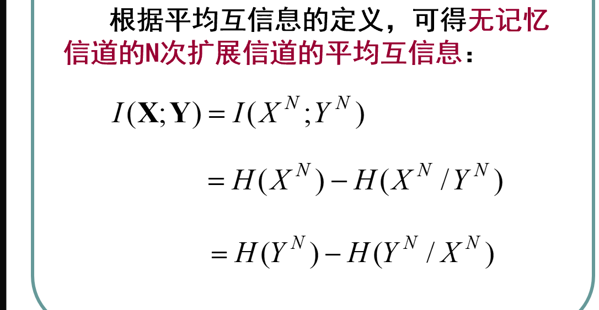
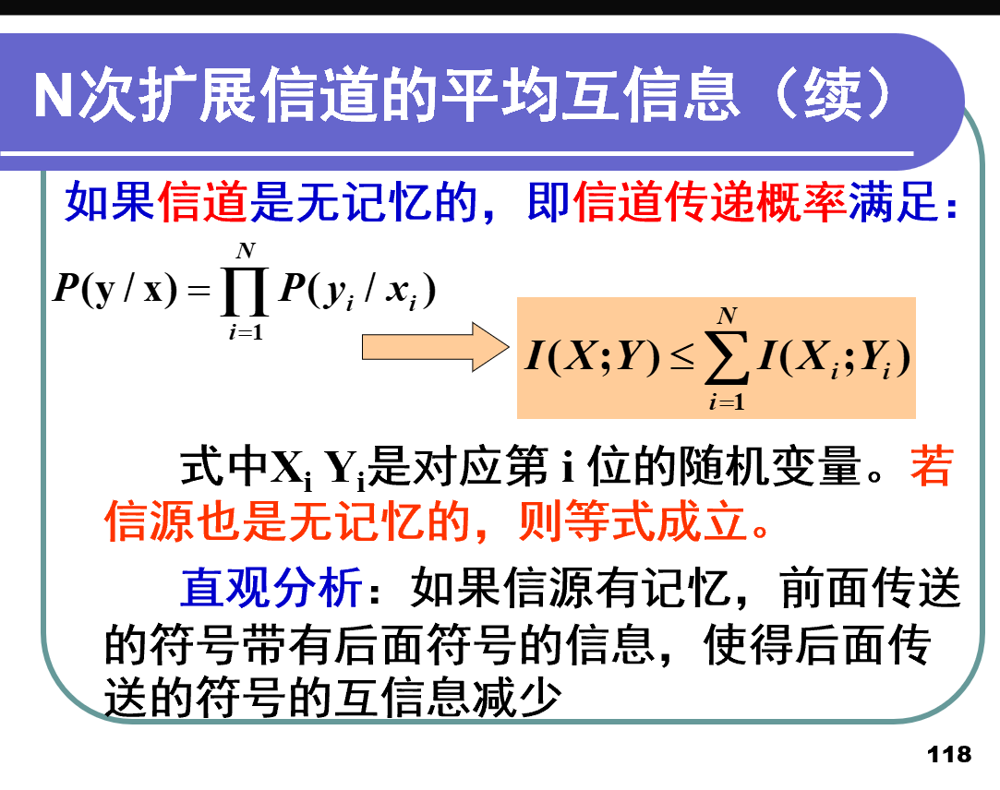
## 离散无记忆N次扩展信道的信道容量
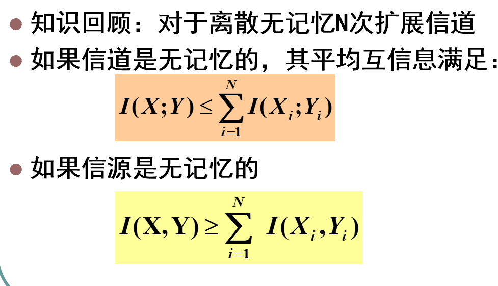
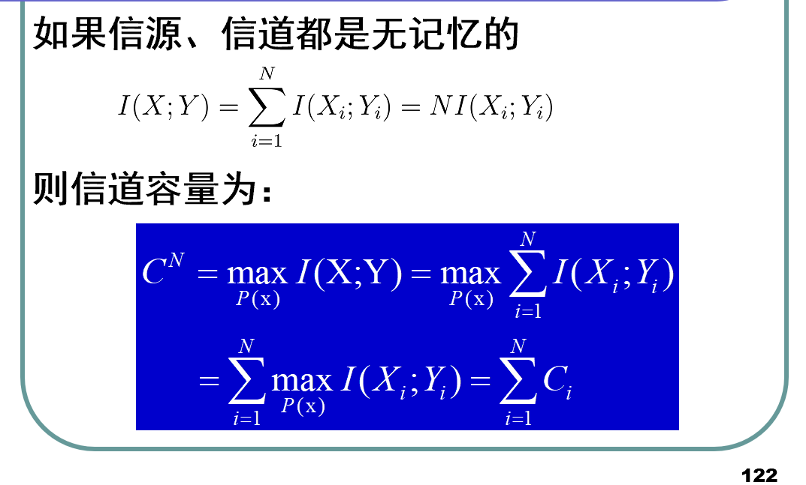
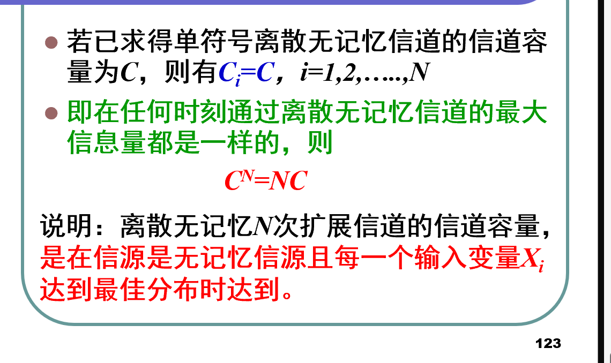
# 串联信道和数据处理定理

## 数据处理定理
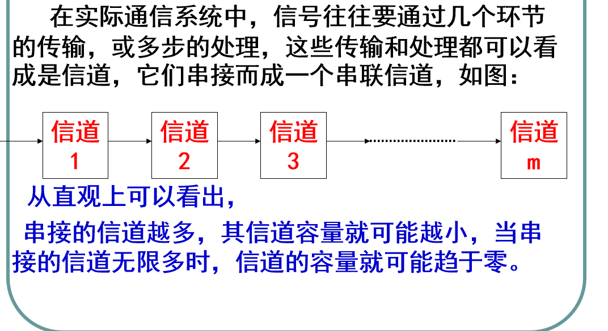
数据处理定理说明，在任何信息传输系统中，最后获得的信息至多是信源所提供的信息，如果一旦在某一过程中丢失一些信息，以后的系统不管如何处理，如果不触及到丢失信息的输入端，就不能再恢复已丢失的信息，这就是信息不增性原理
# 信源和信道的匹配
我们对信道的属性，性质有了一定了解和后，就要考虑怎么将信道的利用最大化，也就是让信息传输率达到信道容量
然而我们知道，只有信源取得最佳分布时，上面的情况才能实现
所以，当信源和信道都确定时，信息传输率达到信道容量，我们称信道和信源相匹配，反之认为信道有剩余
## 信道剩余度
$$信道剩余度 = C - I(X;Y)$$
表示信道的实际传输效率和信道容量的差值
如果是求相对信道剩余度，则将计算结果再除以信道容量
我们可以用这个属性来衡量信道利用率的高低
### 无损信道的剩余度
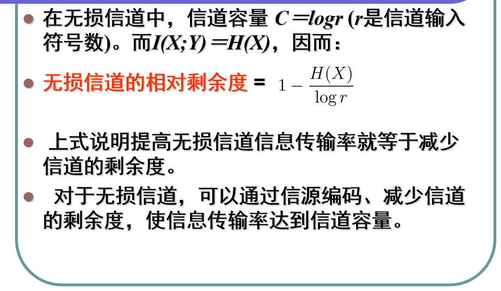
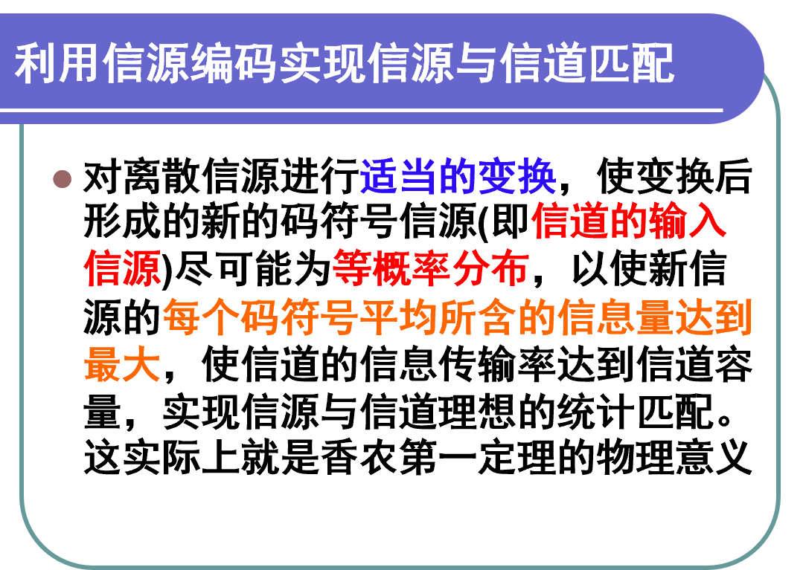