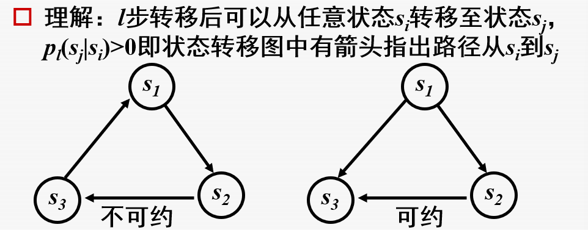
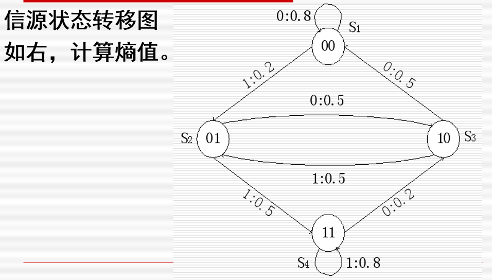

# 马尔可夫信源的定义
## 信源的状态和符号集
有一类信源，输出的符号序列中符号之间的依赖关系有限，即在任意时刻发出符号的概率通常仅与前面若干个符号相关，与更前面的符号无关，因此我们可以认为信源在某时刻发出的符号与信源的状态有关.
所以我们单独定义一个状态空间，来表示在前面信息的影响下，下一次信源发生信号的可能

所以我们就可以用下面这个更复杂的思路来计算输出符号的概率

## 时齐马尔可夫链
一般情况下，状态转移概率和已知状态下符号发生的概率均与时刻l 有关。若这些概率与时刻l 无关，即![[Pasted image 20260405175158.png]]则称为时齐的或齐次的。
此时的信源状态服从时齐马尔科夫链

## 定义：

其实就是前面的定义，这里指的就是只和前面发送过的信息（也就是封装过后的E）有关

## 信源描述——状态转移图

示例如下：

同时 我们也能得到状态转移矩阵
![[Pasted image 20260405182215.png]]

# m阶马尔可夫信源
m阶有记忆离散信源的状态：对m阶有记忆离散信源，在任何时刻l，符号发出的概率只与前面m个符号有关，把这m个符号看作信源在l时刻的状态。
我们用$q$表示信源的符号集，用$q^m$表示信源不同的状态数，m表示信源的长度
也就是说 信源的输出依赖长度为m + 1 的随机序列转化成的状态序列，说白了就是受到之前m + 1个输出信息的影响

## 有限齐次马尔可夫链各态遍历定理
对于一个有限齐次的马尔科夫链，如果存在一个正整数l>0，让对于一切i j = 1，2……q都有$p_l(s_j|s_i) > 0$（也就是说，对于任意状态ij 其总有可能在变化l次后成为对方的状态）
则对于每个j都存在不依赖i的极限 有
$
\lim_{l\to\infty} p_l(s_j \mid s_i) = p(s_j) \quad (j = 1, 2, \dots, q^m)
$
当步数够多时，这个转移到某个事件的概率会收敛到一个固定值
### 性质
#### 可约性
对于前面说的第一个定理 我们称其不可约性，也就是马尔科夫链所有的状态都是互通的，能够互相转化表示

#### 遍历性
对于每一个j都存在不依赖于i的极限$$\lim_{l\to\infty}p_l(s_j|s_i) = p(s_j) (j = 1,2,……,q^m)$$
当步数够多时，这个转移到某个事件的概率会收敛到一个固定值 我们将这个极限值叫状态$s_j$的极限概率
#### 极限概率
是在约束条件下$$
\begin{cases}
p(s_j) > 0, \\
\sum_{j=1}^{q^m} p(s_j) = 1
\end{cases}
$$
方程组$$p(s_j) = \sum_{i=1}^{q^m} p(s_i) p(s_j \mid s_i) \quad (j = 1, 2, \dots, q^m)$$
## m阶马尔可夫信源的极限熵
当时间足够长，遍历的m阶马尔可夫信源可以视为平稳信源
又因为信源发出的符号只和最近的m个符号有关
我们可以根据极限熵定理得到：
$$H_\infty = \lim_{N\to\infty} H(X_N \mid X_1, X_2, \dots, X_{N-1}) = H(X_{m+1} \mid X_1, X_2, \dots, X_m) = H_{m+1}$$
也就是 m阶马尔可夫信源的极限熵等于m阶条件熵
# 例题

[答案](./马尔可夫信源/例题.md)