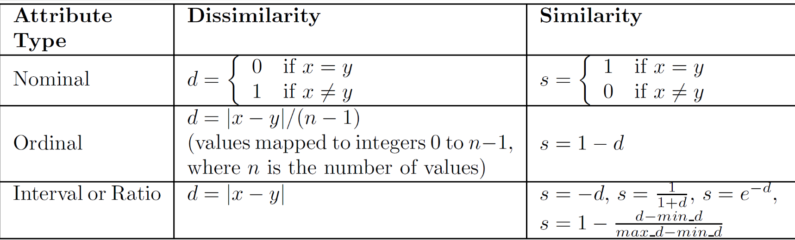
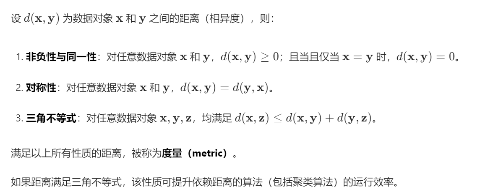
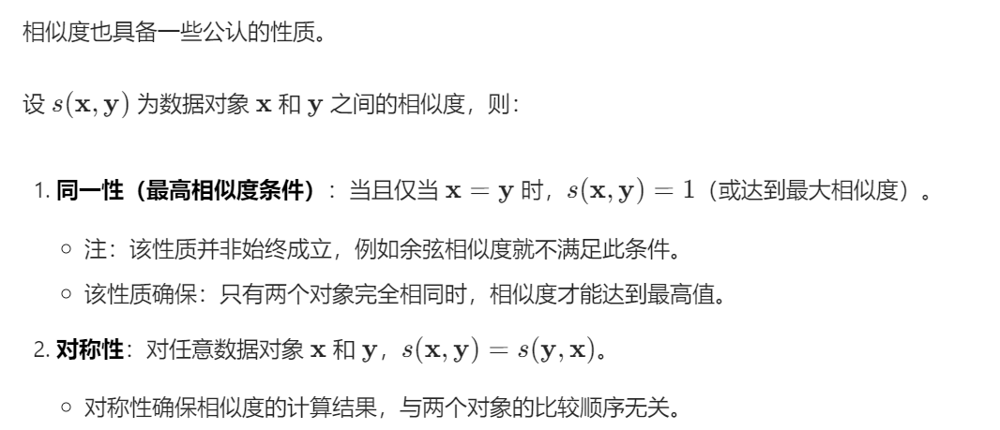
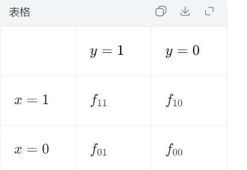
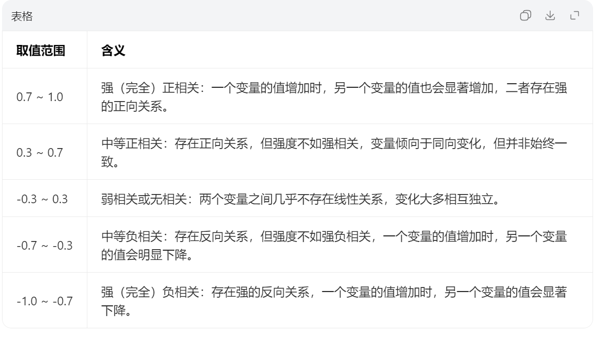
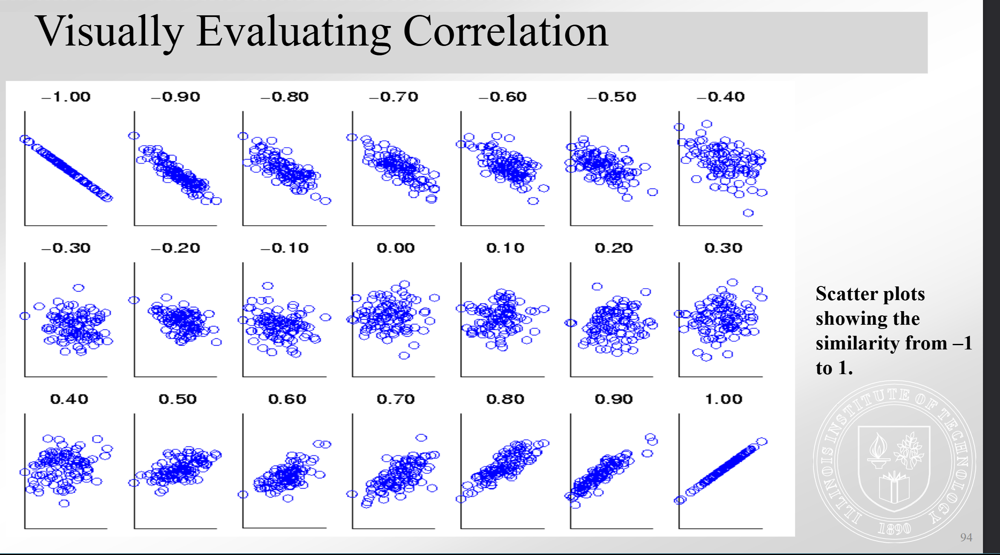
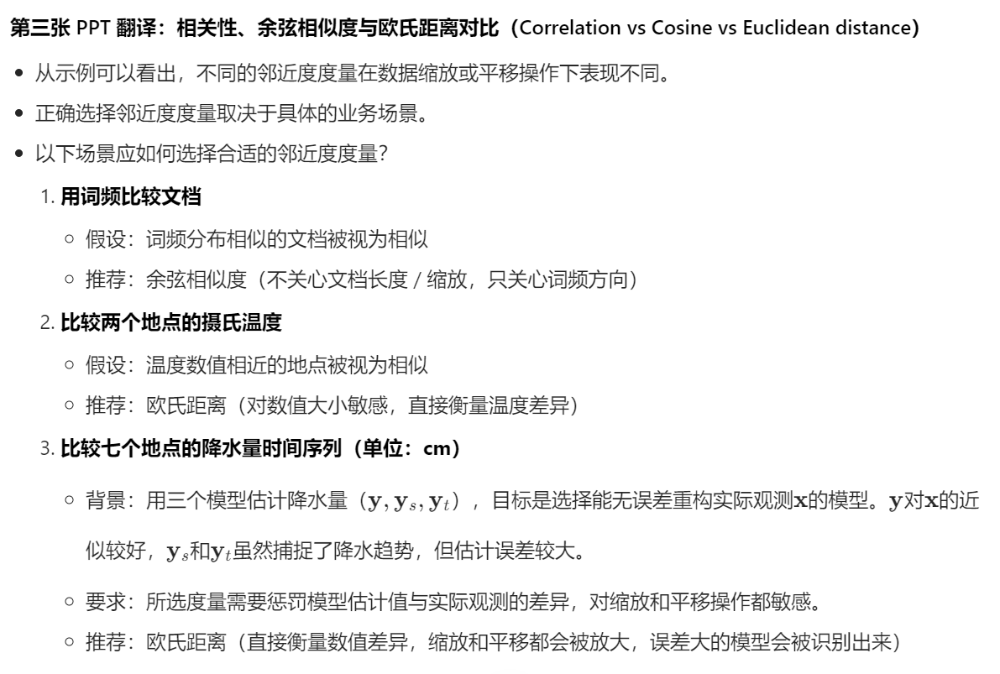
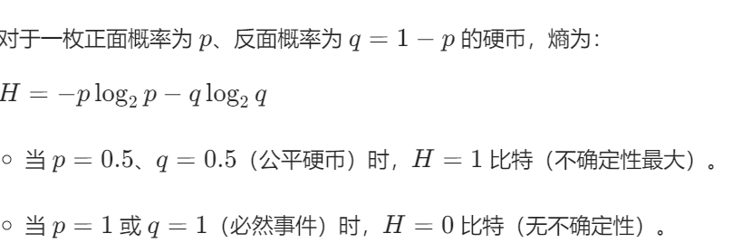

# 相似性与异类度量Similarity and Dissimilarity Measures
可以理解为将数据转换到相似（异）度空间展开分析，我们会用计算的方法来计算出相似度
下面有几个概念：
- 相似度度量：衡量两个数据相似度的指标，通常取值范围为[0,1]，相似度越高，取值越高
- 相异度度量：和相似度正好相反，数值越低，相似度越高
- 邻近度：相似度和相异度的统称
## 计算方法
单个属性的相似度：

这里表示的分别是标准型 有序型和区间型的计算方法
如果不进行一些特殊处理（如归一化）那么直接用|x - y|会让区间型的计算结果脱离[0,1]这个范围

## 数据对象之间的相似度（距离）
下面的情况是对含有多种属性的数据对象的相似度的计算
### 欧氏距离Euclidean Distance
公式如下
$$d(\mathbf{x}, \mathbf{y}) = \sqrt{\sum_{k=1}^{n} (x_k - y_k)^2}$$
### 闵可夫斯基距离Minkowski Distance
欧式距离的推广形式
$$d(\mathbf{x}, \mathbf{y}) = \left( \sum_{k=1}^{n} |x_k - y_k|^r \right)^{1/r}$$
另外 如果r为1 则公式得到是曼哈顿距离/街区距离(曼哈顿距离就是各个维度坐标差值的绝对值的和)
r为2 则和前面的欧式距离公式相同，得到的是欧氏距离
r趋向于无穷时，则收敛为切比雪夫距离/上确界距离

注意不要混淆参数r和维度n
### 距离的常见性质

### 相似度的常见性质

余弦相似度衡量的是向量之间的夹角，所以只要两个向量方向相同，无论长度是否相等，其余弦相似度都是1
### 二进制向量的相似度系数
仅包含二元属性（0，1）的对象的属性向量称为二进制向量，而对这种相似度之间的度量称为相似度系数（similiarity coeffcients）其取值通常在[0,1]之间
仅包含二元属性的两个物体的相似性称为相似系数通常值在0和1之间
#### 简单匹配系数Simple Matching Coefficient, SMC
$$SMC = \frac{f_{11} + f_{00}}{f_{01} + f_{10} + f_{11} + f_{00}}$$
简单匹配系数将0-0匹配和1-1匹配都看作匹配，代表相似，也就是说匹配程度看每一位数是否相同
当0和1都有明确的业务含义时，SMC更加有效
#### 杰卡德系数Jaccard Coefficient
$$J = \frac{f_{11}}{f_{01} + f_{10} + f_{11}}$$
杰卡德系数只关注对应位是否都为1，如果都是1，才算作匹配
这种计算方式在非对称属性（或0代表无意义时）使用更加有效
### 余弦相似度Cosine Similarity
一种计算两个向量方向的相似程度的计算方法
 $$sim(\mathbf{x},\mathbf{y}) = \frac{\sum_{i=1}^{n} x_i y_i}{\sqrt{\sum_{i=1}^{n} x_i^2} \cdot \sqrt{\sum_{i=1}^{n} y_i^2}}$$
 这种计算方式跳出了二元的限制，同时保留了忽略0这一个特质
### 二进制向量的列联表
因为属性是二元的，所以根据其属性的排列有多种情况，我们可以列出一个表来

# 相关性Correlation
相关性用于衡量成对的观测值之间的线性关系，两个变量之间的关系，两个对象之间的关系或衡量属性之间的相似度

## 相关性衡量对象之间的线性关系
### 皮尔逊相关系数
$$\mathrm{corr}(\mathbf{x}, \mathbf{y}) = \frac{\mathrm{covariance}(\mathbf{x}, \mathbf{y})}{\mathrm{standard\_deviation}(\mathbf{x}) \times \mathrm{standard\_deviation}(\mathbf{y})} = \frac{s_{xy}}{s_x s_y}
$$
$$% 协方差
\mathrm{covariance}(\mathbf{x}, \mathbf{y}) = s_{xy} = \frac{1}{n-1} \sum_{k=1}^{n} (x_k - \bar{x})(y_k - \bar{y})
$$
$$
% 标准差
\mathrm{standard\_deviation}(\mathbf{x}) = s_x = \sqrt{\frac{1}{n-1} \sum_{k=1}^{n} (x_k - \bar{x})^2}
$$
$$
% 均值
\bar{x} = \frac{1}{n} \sum_{k=1}^{n} x_k
\bar{y} = \frac{1}{n} \sum_{k=1}^{n} y_k$$
### 相关性的评估
相关性的值总是取值在-1 到1之间 其中-1表示极强的负相关，1表示极强的正相关

可视化评估如下：

### 相关性的缺陷
相关性只检测向量之间的线性关系，如果其不存在线性关系而存在其他关系，则无法被检测到
例子：
向量 x=(−3,−2,−1,0,1,2,3)
向量 y=(9,4,1,0,1,4,9)
关系：yi​=xi2​（y 是 x 的平方）但其相关系数计算后是0

### 相关性 余弦相似度和欧氏距离的对比
我们通过将原本的数据进行缩放（乘一个常数）和平移（加上一个常数），再用这三个方法分别计算相似度后得到的结果是否和变化前相同，得到下面的表格

同时，对于不同的情况应该明智选择特定的计算方法

# 基于信息论的度量方法
互信息（Mutual Information, MI）：衡量一个变量能揭示多少关于另一个变量的信息，即成对变量之间共享的信息量。
最大信息系数（Maximal Information Coefficient, MIC）：互信息的归一化形式，更便于解释和比较不同数据集间的相似度。
信息论和概率论的联系紧密，信息的本质是减少不确定性，对于其知识请前往信息论部分笔记查看，这里没有链接是因为还没写（
## 熵Entropy
熵用于衡量随机变量的不确定性，同时量化了可能的结果的平均信息量
对于n种可能结果，熵的取值在0到$\log_{2}{n}$之间
其计算公式为：$$H(X) = -\sum_{i=1}^{n} p_i \log_2 p_i$$

### 样本数据的熵
对于样本数据，是我们观测一个东西得到的，没有理论数据支撑，而是使用观测比例来代替概率计算熵
假设我们有
m：总观测数（例如：调查的学生总数）
n：不同可能取值的数量（例如：发色种类数）
mi​：第 i 个类别中的观测数
则我们可以得到这个样本的熵
$$H(X) = -\sum_{i=1}^{n} \frac{m_i}{m} \log_2 \left( \frac{m_i}{m} \right)$$
其实这个公式和理论熵的公式是等价的，可以衡量样本中的不确定性或多样性，而对于连续数据，熵的计算方式会更复杂

## 互信息Mutual Information
衡量一个变量能提供的关于另一个变量的信息$$I(X,Y) = H(X) + H(Y) - H(X,Y)$$
其中H(X,Y)表示联合熵，其计算公式为:$$H(X,Y) = -\sum_{i}\sum_{j} p_{ij} \log_2 p_{ij}$$

## 最大信息系数
考虑将变量划分为离散类别的所有分箱形式，满足约束$n_{x} * n_{y} 小于等于 N^{0.6}$
首先对变量进行分箱，计算互信息，然后用$log_2{\min(n_X,n_Y)}$将其归一化